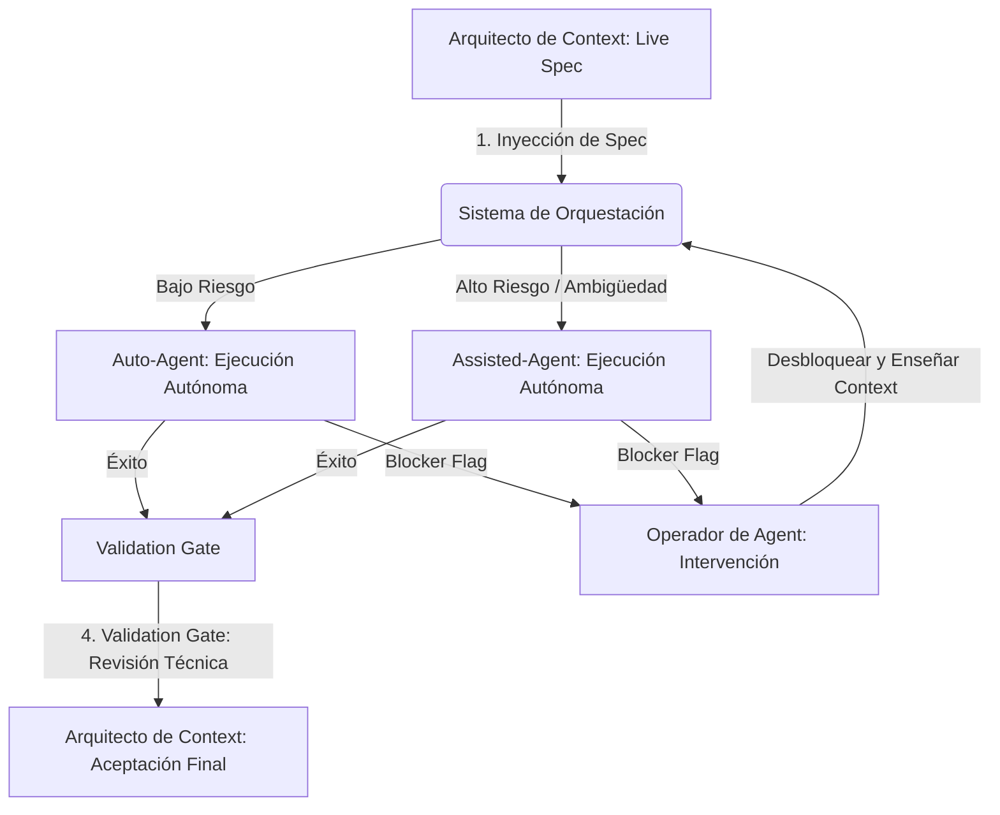

## Descripción General

La Capa de Orquestación define cómo fluye el trabajo entre humanos y los agents de AI en la [[agentic-engineering]]. Introduce un Flujo de Trabajo Triangular que reemplaza el modelo tradicional centrado en el desarrollador con tres roles especializados y una escala de escalamiento de cuatro fases que rige cuándo y cómo las tareas se mueven entre ellos.

## Del Código a la Intención

El desarrollo de software tradicional trata "escribir código" como la unidad de trabajo principal. El desarrollo agentic redefine esa unidad como **definir la intención de negocio precisa**. Cuando la intención es clara, inequívoca y legible por máquina, los agents autónomos pueden ejecutar a máxima velocidad con mínima intervención humana.

Este cambio convierte la [[context-engineering]] en la actividad de mayor apalancamiento en el proceso de desarrollo. Cuanto más claro sea el context, más rápida y confiable será la salida del agent. Los requisitos vagos ya no solo ralentizan a un desarrollador humano; hacen que los agents "alucinen", entren en bucles o produzcan implementaciones sutilmente erróneas. La claridad del context se convierte en la restricción principal en la velocidad de entrega.

La implicación práctica: los equipos que invierten en especificaciones precisas, un context bien estructurado y criterios de aceptación claros superarán drásticamente a los equipos que confían en los agents para que lo "resuelvan".

## El Flujo de Trabajo Triangular

La Capa de Orquestación se basa en tres roles especializados que forman un triángulo de retroalimentación continua. Cada rol tiene una responsabilidad distinta y opera a un nivel de abstracción diferente.

### Arquitecto de Context

El Arquitecto de Context traduce las necesidades del negocio en especificaciones legibles por máquina llamadas Live Specs. Este es el rol estratégico, que se ocupa del **Porqué** y el **Qué**. El Arquitecto de Context es propietario de la definición del problema, los criterios de aceptación y la intención general detrás de cada unidad de trabajo.

Las responsabilidades incluyen:

- Descomponer los requisitos de negocio en specs discretas y bien delimitadas
- Definir criterios de aceptación que los agents puedan verificar programáticamente
- Mantener el Context Index (la base de conocimiento estructurada de la que se nutren los agents)
- Realizar la aceptación final del trabajo completado

### El Agent

El Agent es el motor de ejecución autónomo. Opera a nivel táctico, centrado completamente en el **Cómo**. Dada una Live Spec, el agent aprovisiona un espacio de trabajo aislado, implementa la solución y la valida contra los criterios de aceptación de la spec.

Características clave:

- Trabaja dentro de un Workbench aislado (entorno efímero, sandboxed)
- Sigue la spec de forma determinista en lugar de tomar decisiones arquitectónicas
- Se autovalida contra criterios de evaluación automatizados
- Levanta una Blocker Flag cuando encuentra ambigüedad o alcanza una restricción que no puede resolver

### Operador de Agent

El Operador de Agent proporciona supervisión [[human-in-the-loop]]. Este rol sirve como ruta de escalamiento para situaciones que superan las capacidades del agent: problemas de alta ambigüedad, casos límite arquitectónicos, decisiones sensibles a la seguridad y situaciones novedosas no cubiertas por el context existente.

Las responsabilidades incluyen:

- Responder a las Blocker Flags de los agents ("Misiones de Rescate")
- Depurar fallos del agent y actualizar el context para evitar recurrencias
- Validar decisiones arquitectónicas e implicaciones de seguridad
- Enriquecer el Context Index con las lecciones aprendidas de las intervenciones

## La Escala de Escalamiento de Cuatro Fases

El trabajo se mueve a través de cuatro fases distintas, con puntos de traspaso claros y [[guardrails]] en cada transición.

### Fase 1: Orquestación de la Intención

El Arquitecto de Context envía una Live Spec al Sistema de Orquestación. El sistema realiza una clasificación automatizada, enrutando la tarea según el perfil de riesgo y la complejidad:

- **Tareas de bajo riesgo** (alcance bien definido, patrones existentes, bajo radio de impacto) se dirigen directamente a un Auto-Agent para una ejecución completamente autónoma.
- **Tareas de alto riesgo o ambiguas** (nuevos patrones, cambios sensibles a la seguridad, preocupaciones transversales) se dirigen a un Assisted-Agent que trabaja bajo una supervisión más estrecha del operador.

### Fase 2: Ejecución Autónoma

El agent aprovisiona un Ephemeral Workbench, un entorno sandboxed que contiene todo lo necesario para ejecutar la tarea. Implementa la solución, luego valida el resultado contra el Eval Harness, un conjunto de comprobaciones automatizadas definidas en la spec.

Si todas las comprobaciones pasan, el trabajo se mueve a la Validation Gate. Si el agent encuentra un blocker que no puede resolver, levanta una Blocker Flag y el trabajo escala a la Fase 3.

### Fase 3: Refinamiento del Context

Cuando un agent levanta una Blocker Flag, el Operador de Agent interviene en lo que se denomina una "Misión de Rescate". El operador diagnostica el problema, que típicamente se encuadra en una de estas categorías:

- **Spec ambigua** — la intención no estaba clara o estaba incompleta
- **Context faltante** — al agent le faltaba información que necesitaba
- **Problema novedoso** — ningún patrón existente cubre este escenario
- **Conflicto de restricciones** — los requisitos se contradicen

El operador resuelve el blocker, actualiza el Context Index con el nuevo conocimiento y devuelve la tarea al Sistema de Orquestación. Esto crea un ciclo de retroalimentación: cada intervención hace que el sistema sea más inteligente y reduce los escalamientos futuros.

### Fase 4: Puerta de Aceptación Final

El trabajo completado pasa por una Revisión Técnica que evalúa:

- **Seguridad** — sin nuevas vulnerabilidades, secretos manejados correctamente, controles de acceso intactos
- **Mantenibilidad** — el código sigue patrones establecidos, está bien documentado y es testeable
- **Ajuste arquitectónico** — los cambios se alinean con la arquitectura del sistema y no introducen acoplamiento no deseado

El Arquitecto de Context realiza la aceptación final, confirmando que la implementación satisface la intención de negocio original.

## El Flujo de Orquestación

El siguiente diagrama ilustra cómo el trabajo fluye a través de las cuatro fases, con el Sistema de Orquestación enrutando tareas según el riesgo y el Operador de Agent proporcionando intervención cuando sea necesario.

Este flujo crea un sistema de auto-mejora. Cada ciclo a través de la escala de escalamiento enriquece el Context Index, ajusta el Eval Harness y reduce la proporción de tareas que requieren intervención humana con el tiempo.

## El Ciclo Context-Decisión-Aprendizaje

Subyacente al Flujo de Trabajo Triangular hay un ciclo de retroalimentación continuo que impulsa la mejora en cada iteración:

1.  **Context** — El Arquitecto de Context proporciona conocimiento estructurado (Live Specs, Context Index) que define qué debe suceder y por qué.
2.  **Decisión** — El Agent (o el Operador de Agent, cuando se escala) toma decisiones tácticas sobre cómo implementar la intención dentro de las restricciones dadas.
3.  **Aprendizaje** — Cada ejecución, ya sea exitosa o escalada, genera nuevo conocimiento que retroalimenta al Context Index, refinando el context futuro y reduciendo la ambigüedad.

Este ciclo significa que el sistema mejora progresivamente en la ejecución autónoma. Al principio, muchas tareas escalan al Operador de Agent. Con el tiempo, a medida que el context se acumula y las specs se vuelven más precisas, la proporción de ejecuciones completamente autónomas aumenta.

## Diseñando para [[agentic-workflows]]

Al implementar la Capa de Orquestación, tenga en cuenta estos principios:

-   **Las Specs son artefactos de primera clase.** Trate las Live Specs con el mismo rigor que el código de producción. Versionelas, revíselas, téstelas.
-   **El aislamiento no es negociable.** Cada ejecución de agent debe ocurrir en un workbench efímero y sandboxed. Nunca permita que los agents modifiquen el estado compartido directamente.
-   **La escalación es una característica, no un fallo.** Las Blocker Flags son el sistema funcionando correctamente. Optimice para escalaciones rápidas e informativas en lugar de intentar eliminarlas por completo.
-   **El context se acumula.** Cada intervención del operador debe producir una actualización de context reutilizable. Si resuelve el mismo problema dos veces sin actualizar el Context Index, tiene una brecha en el proceso.

## Próximos Pasos

Con la Capa de Orquestación implementada, la siguiente página cubre los [Pilares Fundamentales](/en/handbook/framework/core-pillars) que proporcionan la base arquitectónica para los equipos agentic.
