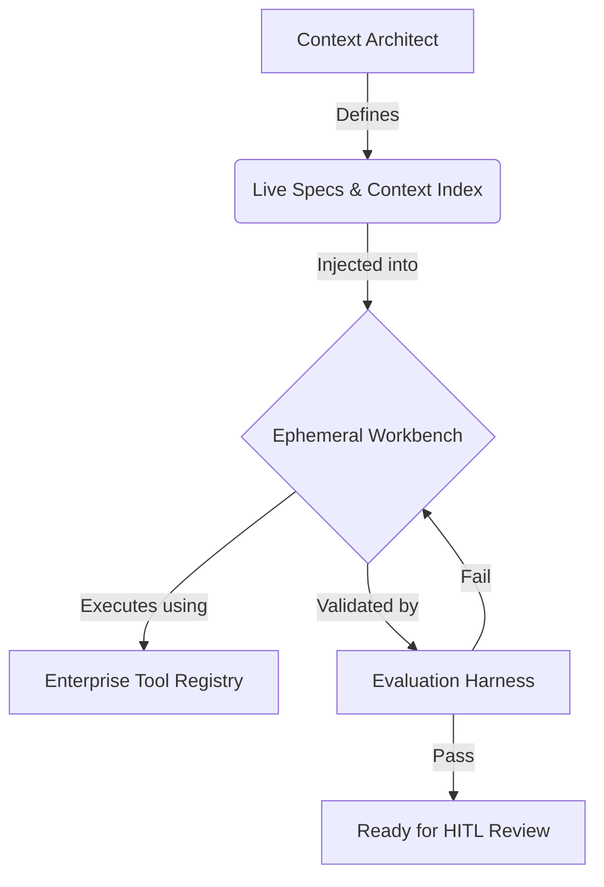

## Visión General

El context es la principal limitación del desarrollo agentic. La calidad de cada ejecución de agent no está limitada por la capacidad del modelo, sino por la claridad, completitud y actualidad del context que recibe. Esta página cubre la Arquitectura Context-First, el Context Index que sirve como memoria institucional del agent, los Live Specs que empaquetan los requisitos en planos legibles por máquina, y las prácticas de higiene que mantienen el context saludable a lo largo del tiempo.

## Arquitectura Context-First

En el desarrollo tradicional, la principal limitación es el tiempo del desarrollador. Siempre hay más tareas que ingenieros para completarlas. En el desarrollo agentic, la limitación cambia: los modelos pueden generar código más rápido que los humanos, pero solo cuando tienen una entrada precisa y bien estructurada para trabajar.

Este es el principio fundamental de [[context-engineering]]: el context es código. El context que proporcionas a un agent no es documentación suplementaria, es la entrada principal que determina la calidad de la salida. Un modelo mediocre con excelente context supera a un modelo de vanguardia con context vago.

### La Claridad del Context como Limitación Principal

Cuando los agents tienen un context preciso, completo y bien estructurado, se ejecutan de forma fiable y rápida. Cuando el context es vago, incompleto o contradictorio, producen alucinaciones, omiten casos límite, entran en bucles improductivos o generan código que, aunque funciona técnicamente, viola la intención arquitectónica.

Esto significa que el [[context-window]] no es solo una limitación técnica de los modelos de lenguaje. Es una limitación arquitectónica que define cómo:

- **Descomponer el trabajo** —Las tareas deben acotarse para que todo el context relevante quepa dentro de la context window del modelo.
- **Estructurar especificaciones** —Los _specs_ deben ser autocontenidos, referenciando solo lo que el agent necesita para la tarea actual.
- **Organizar el conocimiento** —El Context Index debe ser recuperable en segmentos específicos, no como un volcado monolítico.

### El Principio Context = Código

Trata los artefactos de context con el mismo rigor que aplicas al código fuente:

- **Con control de versiones** —El context reside en el repositorio junto con el código que describe.
- **Revisado** —Los cambios en los _specs_, las reglas arquitectónicas y los glosarios de dominio pasan por _pull requests_.
- **Probado** —Las verificaciones de validación confirman que el context es internamente consistente y que las referencias se resuelven correctamente.
- **Mantenido** —El context obsoleto se archiva o se actualiza con una cadencia regular.

Las organizaciones que tratan el context como un artefacto de ingeniería de primera clase observan un rendimiento del agent mediblemente mejor que aquellas que lo tratan como documentación informal.

## El Context Index

El Context Index es la base de conocimiento curada de la que los agents se nutren durante la ejecución. Es la suma estructurada de todo lo que la organización sabe sobre sus sistemas, estándares y prácticas, organizado para el consumo de máquinas.

### Qué Contiene el Context Index

El Context Index suele incluir:

- **Live Specs** —Especificaciones legibles por máquina para elementos de trabajo actuales y recientes.
- **Constitución del Sistema** —Principios arquitectónicos, estándares de codificación, políticas de seguridad y reglas de dominio.
- **Context del Codebase** —Definiciones de tipo, esquemas de API, _test suites_ y documentación _inline_.
- **Glosario de Dominio** —Definiciones de términos de negocio, abreviaturas y lenguaje específico del dominio.
- **Context Histórico** —Decisiones pasadas, _blockers_ resueltos, lecciones aprendidas y hallazgos _postmortem_.
- **Golden Samples** —Implementaciones de referencia que demuestran la forma correcta de construir cada tipo de componente.

### Recuperación con RAG

Para _codebases_ no triviales, el Context Index es demasiado grande para inyectarlo en un solo _prompt_. Los patrones de [[rag|RAG]] (Retrieval-Augmented Generation) resuelven esto recuperando dinámicamente solo los segmentos de context relevantes para la tarea actual.

Un _pipeline_ de RAG bien implementado:

1.  **Indexa** el Context Index en un _vector store_, _chunked_ y _embedded_ para la búsqueda de similitud semántica.
2.  **Consulta** el _store_ en tiempo de ejecución utilizando la descripción de la tarea, el contenido del _spec_ y las referencias de código relevantes.
3.  **Inyecta** el context recuperado en el [[system-prompt]] del agent o en la memoria de trabajo junto con las instrucciones de la tarea.
4.  **Clasifica** los resultados por relevancia, actualidad y autoridad para asegurar que el agent vea el context más útil primero.

RAG reduce la carga del Context Architect (quien ya no necesita seleccionar manualmente el context para cada tarea) y aumenta la proporción de tareas que los agents manejan de forma autónoma.

### Context Tóxico

No todo el context es útil. El Context Tóxico es información desactualizada, conflictiva o engañosa que persiste en el Context Index y hace que los agents produzcan una salida incorrecta.

Fuentes comunes de context tóxico:

- **Documentación obsoleta** —Documentos de API que describen _endpoints_ que ya no existen, o guías arquitectónicas que hacen referencia a patrones _deprecated_.
- **Estándares conflictivos** —Dos documentos que prescriben enfoques diferentes para el mismo problema. El agent sigue uno y viola el otro.
- **Ejemplos legados** —Muestras de código antiguas que utilizan patrones que el equipo ha abandonado. Los agents los tratan como precedente autorizado.
- **Registros de decisiones no resueltos** —_ADRs_ marcados como "propuestos" que los agents interpretan como "aceptados."

El context tóxico es insidioso porque sus efectos se parecen a las [[hallucination|alucinaciones]]. El agent genera código con confianza que sigue el patrón incorrecto, no porque haya alucinado, sino porque siguió fielmente una entrada deficiente. La solución no es un mejor modelo; es un context más limpio.

## Live Specs

Un Live Spec es un paquete de requisitos estructurado y ejecutable que sirve como entrada principal para la ejecución del agent. A diferencia de una _user story_ o una descripción de _ticket_ tradicional, un Live Spec es lo suficientemente preciso como para que un agent pueda implementarlo sin hacer preguntas aclaratorias y verificar su propio trabajo contra los criterios de aceptación definidos.

### Anatomía de un Live Spec

Cada Live Spec es un paquete que contiene cuatro componentes:

1.  **Intención del Usuario** —Una declaración clara de lo que el usuario o la empresa necesita, expresada en términos del resultado deseado en lugar de los detalles de implementación.
2.  **Segmento de Context** —El subconjunto específico del Context Index relevante para esta tarea: archivos de código relacionados, esquemas de API, reglas arquitectónicas y definiciones de dominio.
3.  **Mapa de Restricciones** —Límites explícitos en la solución: qué patrones usar, qué patrones evitar, umbrales de rendimiento, requisitos de seguridad y restricciones de compatibilidad.
4.  **Puerta de Validación** —Criterios de aceptación ejecutables que el agent debe satisfacer antes de que la tarea se considere completa. Estas son verificaciones automatizadas, no descripciones en prosa.

### Los Tres Activos Mínimos

Cada _spec_ debe contener al menos un Contrato Comportamental, una Constitución del Sistema y un Mapa de Tareas Accionables. Para ver las definiciones completas de cada activo y cómo se relacionan con el ciclo de vida del _spec_, consulta [Spec-Driven Development](/en/handbook/framework/spec-driven-development).

### Control de Versiones y Modularidad

Los Live Specs son artefactos con control de versiones que residen en el repositorio junto con el código que describen:

- **Versionado** —Cada cambio en el _spec_ se rastrea en Git con historial completo. Siempre puedes ver cómo era el _spec_ cuando se generó una implementación particular.
- **Modular** —Las características grandes se descomponen en múltiples _specs_ que se referencian entre sí. Cada _spec_ es lo suficientemente autocontenido para la ejecución independiente del agent.
- **Ejecutable** —Los criterios de aceptación se escriben como verificaciones automatizadas. El agent no necesita que un humano le diga si los criterios se cumplen.
- **En Evolución** —Los _specs_ se actualizan a medida que cambian los requisitos, la implementación revela nuevos casos límite o la arquitectura del sistema cambia. Un _spec_ nunca está "terminado", evoluciona con el _codebase_.

## Cómo Encaja Todo

El siguiente diagrama ilustra el flujo desde la gestión del context hasta la ejecución del agent:

El Context Architect define y mantiene tanto los Live Specs como el Context Index. Cuando se despacha una tarea, el _spec_ relevante y el segmento de context se inyectan en un Ephemeral Workbench. El agent se ejecuta utilizando herramientas del Enterprise Tool Registry. Su salida es validada por el Evaluation Harness. Si la evaluación es exitosa, el resultado pasa a revisión humana. Si la evaluación falla, el agent recibe _feedback_ y reintenta dentro del mismo _workbench_.

## Higiene del Context

El context es un activo vivo que se degrada sin un mantenimiento activo. Las organizaciones que invierten en la higiene del context observan un rendimiento sostenido del agent. Las que no lo hacen, ven una erosión gradual de la calidad a medida que el Context Index se llena de información obsoleta y conflictiva.

### El Ciclo de Higiene Mensual

Adopta una cadencia mensual para el mantenimiento del context:

1.  **Auditar** —Revisa el Context Index en busca de obsolescencia. Marca cualquier documento, _spec_ o ejemplo que no se haya actualizado en el último trimestre. Haz una referencia cruzada con los cambios de código recientes para identificar el context que se ha alejado de la realidad.
2.  **Archivar** —Mueve la documentación obsoleta, los _specs_ completados y los ejemplos _deprecated_ a un archivo. El context archivado se excluye de la recuperación de RAG, pero se conserva para referencia histórica.
3.  **Fijar** —Identifica nuevos estándares, patrones o decisiones adoptados en el último mes. Fija estos como entradas autorizadas en el Context Index para que tengan precedencia en la recuperación.
4.  **Validar** —Ejecuta verificaciones de consistencia automatizadas en todo el Context Index. Busca orientación conflictiva, referencias rotas y entradas duplicadas.

### Propiedad

La higiene del context funciona mejor cuando tiene una propiedad clara. El Context Architect es responsable de la salud general del Context Index, pero los dominios individuales deben tener mantenedores designados: los ingenieros que conocen el código y pueden juzgar si el context sigue siendo preciso.

### Señales de Advertencia

Presta atención a estos indicadores de que la higiene del context está decayendo:

- La calidad de la salida del agent disminuye en tipos de tareas previamente bien manejados.
- Los agents generan código que utiliza patrones _deprecated_.
- Mayor frecuencia de correcciones humanas durante la revisión.
- Implementaciones conflictivas en diferentes características que deberían seguir el mismo patrón.

## Qué Sigue

Con la gestión del context implementada, la siguiente pregunta es: ¿cómo sabes que la salida del agent cumple tus estándares? La siguiente página cubre el Evaluation Harness: las pruebas automatizadas, las _quality gates_ y los mecanismos de gobernanza que validan todo lo que producen los agents.
