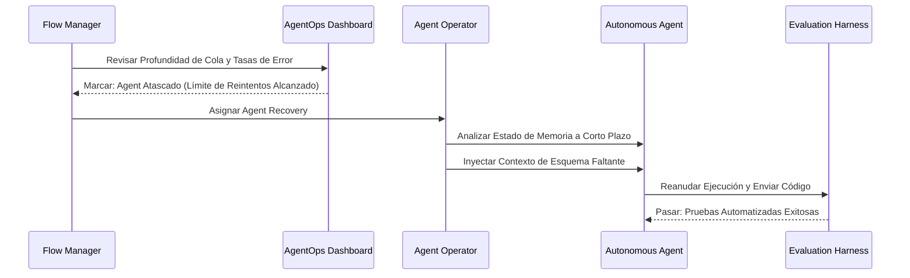

## Descripción General

Las ceremonias Scrum tradicionales fueron diseñadas para equipos humanos que trabajaban en Sprints de dos semanas. El desarrollo con agents opera a un ritmo fundamentalmente diferente: los agents generan código en minutos, no en días, y el volumen de producción abruma los procesos de revisión construidos para una entrega a ritmo humano. Esta página define las rutinas de gobernanza que reemplazan las ceremonias tradicionales, organizadas por cadencia, desde la estrategia trimestral hasta la ejecución en tiempo real.

## Por Qué Fallan las Ceremonias Tradicionales

Las ceremonias Scrum asumen un ritmo predecible: planificar durante dos semanas, ejecutar, revisar, retrospectiva. Tres propiedades de los [[agentic-workflows]] invalidan esta suposición:

- **Velocidad** — Un agent puede producir un pull request funcional en minutos. Una cadencia de Sprint de dos semanas introduce retrasos artificiales entre la especificación y la entrega.
- **Volumen** — Un solo Agent Operator que supervisa múltiples agents genera más producción en un día de lo que un desarrollador tradicional produce en un Sprint. Las ceremonias de revisión diseñadas para 5-10 PRs por Sprint no pueden manejar más de 50 por día.
- **Imprevisibilidad de la salida** — El código generado por agents varía en calidad según la calidad del contexto, no el esfuerzo invertido. Algunas tareas se completan perfectamente en la primera ejecución. Otras requieren múltiples ciclos de intervención. Las ceremonias de planificación que asumen un tamaño de tarea uniforme producen pronósticos inexactos.

El reemplazo no es un menor número de ceremonias, sino ceremonias con la cadencia correcta, con los participantes adecuados, enfocadas en las actividades que realmente rigen la ejecución impulsada por agents.

## Trimestral y Mensual: Alineación Estratégica y Salud del Sistema

### Definición Estratégica de Especificaciones (Trimestral)

La rutina de gobernanza de más alto nivel traduce la visión del producto en trabajo ejecutable por máquina. El Context Architect es el responsable de esta ceremonia.

**Propósito:** Descomponer la hoja de ruta del producto en Epics, redactar Live Specs de alto nivel para cada Epic y definir compuertas [[human-in-the-loop]] que determinen qué tareas requieren aprobación humana durante la ejecución.

**Actividades:**

1. Revisar la hoja de ruta del producto e identificar los Epics para el próximo trimestre.
2. Para cada Epic, redactar una Live Spec de alto nivel que capture la intención, el alcance, los criterios de aceptación y las restricciones arquitectónicas.
3. Asignar niveles de riesgo a cada Epic y configurar las compuertas HITL en consecuencia: los Epics de bajo riesgo pueden fluir con una revisión humana mínima, mientras que los Epics de alto riesgo requieren la aprobación del Agent Operator en cada etapa.
4. Identificar las dependencias entre Epics y secuenciarlas para minimizar los bloqueos.

**Salida:** Un backlog de Epics priorizado con borradores de Live Specs y configuraciones de compuertas HITL, listo para la descomposición en trabajo semanal.

**Equivalente Agile:** Planificación Trimestral / Planificación de PI.

### Ciclos de Mantenimiento del Sistema (Mensual)

Las rutinas mensuales se centran en la salud del sistema, asegurando que la infraestructura, el contexto y la economía de la ejecución de agents sigan siendo sólidos. Cuatro actividades se ejecutan en paralelo, cada una a cargo de un rol diferente:

### Auditoría de Límites (Principal Architect)

Revisar la integridad de los límites de dominio. A medida que los agents generan código a escala, se acumula la deriva arquitectónica: los módulos desarrollan dependencias no deseadas, los bounded contexts se filtran y las convenciones de nomenclatura se erosionan. La Auditoría de Límites detecta esta deriva antes de que se agrave.

- Ejecutar pruebas automatizadas de restricciones arquitectónicas en todo el codebase.
- Marcar cualquier nueva violación introducida desde la última auditoría.
- Actualizar los Golden Samples si los patrones han evolucionado.

### Ciclo de Higiene del Contexto (Context Architect)

Auditar el Context Index en busca de obsolescencia, redundancia y lagunas. La calidad de la salida de los agents se degrada cuando la base de conocimiento de la que extraen información contiene datos obsoletos o un contexto faltante.

- Eliminar esquemas API obsoletos, registros de decisiones anticuados y documentación desactualizada.
- Agregar nuevas entradas de contexto para sistemas, APIs o conceptos de dominio recientemente introducidos.
- Validar que las Live Specs hagan referencia a fuentes de contexto actuales y precisas.

### Revisión de FinOps y ROI (Flow Manager)

Analizar la economía de la ejecución de agents durante el último mes. Rastrear el costo por característica, las tendencias de consumo de tokens y la relación entre el valor generado por agents y el gasto en compute.

- Identificar tareas donde el costo de ejecución del agent superó el valor entregado.
- Marcar patrones de consumo de tokens descontrolados e implementar mecanismos de protección presupuestaria.
- Informar métricas de eficiencia combinadas a las partes interesadas.

### Lanzamiento de Capacidades de Plataforma (Agent Platform Engineering)

Implementar mejoras de infraestructura en el entorno de ejecución de agents: nuevas integraciones de herramientas, actualizaciones de seguridad del sandbox y optimizaciones de rendimiento.

- Desplegar definiciones de herramientas actualizadas y configuraciones de servidor MCP.
- Implementar parches de seguridad en el Workbench Runtime.
- Actualizar las políticas de egreso de red basadas en nuevos requisitos de integración.

## Semanal: Planificación Táctica y Gobernanza

Las rutinas semanales forman el corazón operativo del Equipo Híbrido. Reemplazan el ciclo de Sprint Planning / Sprint Review / Retrospective con actividades ajustadas para la ejecución impulsada por agents.

### Bloque de Ingeniería de Especificaciones

**Reemplaza a:** Refinamiento de Backlog

El Context Architect y el Principal Systems Architect colaboran para producir Paquetes de Contexto, los paquetes de especificaciones, reglas arquitectónicas, Golden Samples y contexto de dominio que los agents necesitan para ejecutar tareas.

**Actividades:**

1. Seleccionar las tareas de mayor prioridad del backlog de Epics.
2. Para cada tarea, redactar una Live Spec detallada con criterios de aceptación, casos límite y contratos de entrada/salida.
3. Adjuntar Golden Samples relevantes y restricciones arquitectónicas.
4. Empaquetar todo en un Paquete de Contexto listo para el consumo del agent.

**Salida:** Un conjunto de Paquetes de Contexto, cada uno conteniendo todo lo que un agent necesita para producir una implementación funcional.

La calidad de este bloque determina la calidad de toda la producción del agent de la semana. Apresurar la ingeniería de especificaciones para "hacer que los agents trabajen más rápido" es el error más común y costoso que cometen los equipos.

### Planificación de Contexto y Asignación

**Reemplaza a:** Sprint Planning

El Context Architect y el Flow Manager trian la complejidad de las tareas, dirigen el trabajo al ejecutor adecuado y establecen el Presupuesto de Tokens semanal.

**Actividades:**

1. Clasificar cada tarea como **Listo para Agent** (contexto suficiente, especificación clara, límites bien definidos) o **Primero Humano** (requisitos ambiguos, críticos para la seguridad, requiere decisiones arquitectónicas novedosas).
2. Dirigir las tareas Listo para Agent al tipo de agent apropiado: Feature Agent para nueva funcionalidad, Maintenance Agent para actualizaciones y migraciones.
3. Dirigir las tareas Primero Humano a los Agent Operators para implementación manual.
4. Establecer el Presupuesto de Tokens semanal, el gasto máximo de compute autorizado para la ejecución de agents. Esto previene costos descontrolados y fuerza la priorización.

**Salida:** Un plan de asignación de tareas con decisiones claras de dirección y un Presupuesto de Tokens definido.

### Revisión de Gobernanza de Arquitectura

**Reemplaza a:** Revisión de Diseño Técnico

El Principal Systems Architect revisa y aprueba (o rechaza) los diseños arquitectónicos antes de que los agents generen código significativo. Esta es una compuerta, no una discusión: los diseños que violan los principios arquitectónicos son rechazados y devueltos para revisión.

**Actividades:**

1. Revisar los diseños propuestos para las próximas tareas de los agents.
2. Verificar que los diseños respeten los límites de los bounded contexts y las reglas de dependencia.
3. Aprobar los diseños que cumplen con los estándares arquitectónicos.
4. Rechazar los diseños que introducirían deuda estructural, con orientación específica sobre las correcciones necesarias.

**Salida:** Un conjunto de diseños aprobados listos para la ejecución del agent, y un conjunto de diseños rechazados con instrucciones de revisión.

Esta revisión previene la clase más costosa de error del agent: código estructuralmente sólido que viola principios arquitectónicos. Un agent puede producir un módulo perfectamente funcional que crea un acoplamiento no deseado entre dominios. Detectar esto antes de la ejecución ahorra órdenes de magnitud más esfuerzo que arreglarlo después.

### Validación de Incrementos y Retrospectiva del Sistema

**Reemplaza a:** Sprint Review

El equipo revisa la producción de la semana en Entornos de Vista Previa, instancias desplegadas y en ejecución de código generado por agents, y evalúa el rendimiento del sistema.

**Actividades:**

1. Demostrar las características completadas en Entornos de Vista Previa, no solo las diferencias de código.
2. Evaluar la **Verificación de Resultados** (¿la característica entrega valor de negocio?) en lugar de solo la **Verificación de Salida** (¿el agent produjo código que pasa las pruebas?). Una característica puede pasar todas las pruebas y aun así no entregar lo que el negocio realmente necesita.
3. Revisar las métricas de rendimiento del agent: Relación Especificación-a-Código, Relación de Corrección y adherencia al Presupuesto de Tokens.
4. Identificar mejoras sistémicas: especificaciones que necesitan más detalle, reglas arquitectónicas que necesitan ser más estrictas, lagunas de contexto que causaron fallas del agent.

**Salida:** Incrementos validados listos para producción y una lista de mejoras sistémicas para el próximo ciclo.

## Diario: Ejecución y el Agent Operator

Las rutinas diarias se centran en la ejecución en tiempo real. El objetivo es mantener a los agents productivos y desbloqueados, interviniendo con precisión cuándo y dónde se necesita el juicio humano.

### Sincronización Diaria de Flujo

**Reemplaza a:** Daily Standup

El Flow Manager lidera una breve revisión del Panel de Control de AgentOps, la interfaz de monitoreo en tiempo real que rastrea el estado de ejecución del agent en todo el equipo.

**Actividades:**

1. Revisar la profundidad de la cola: ¿cuántas tareas están esperando la ejecución del agent y cuántas están en curso?
2. Verificar los tiempos de espera: ¿alguna tarea está detenida esperando contexto, revisión o infraestructura?
3. Monitorear las tasas de error: ¿los agents están fallando a tasas más altas de lo normal, indicando un problema sistémico con la calidad del contexto o la infraestructura?
4. Identificar agents atascados, aquellos que han excedido los límites de reintento o han entrado en bucles, y asignar Agent Recoveries a los Agent Operators.

**Duración:** 10-15 minutos. Esto es una verificación de estado, no un foro de discusión.

**Salida:** Una imagen clara de la salud del pipeline y una lista de Agent Recoveries asignadas.

### Ejecución en Tiempo Real: La Agent Recovery

Cuando un agent se atasca, entrando en un bucle por una prueba fallida, malinterpretando una especificación o produciendo una salida que viola las restricciones arquitectónicas, un Agent Operator ejecuta una Agent Recovery.

**El flujo de trabajo de la Agent Recovery:**

1. **Diagnosticar** — El operador examina la memoria a corto plazo del agent: ¿qué contexto recibió? ¿Qué pasos tomó? ¿Dónde se desvió del camino esperado?
2. **Inyectar** — El operador proporciona la pieza faltante: una referencia de esquema corregida, una restricción explícita que el agent pasó por alto, una aclaración del lenguaje ambiguo de la especificación. Esto es [[context-engineering]] aplicado en tiempo real.
3. **Reanudar** — El agent reanuda la ejecución con el contexto inyectado y continúa hasta su finalización.

Las Agent Recoveries son la actividad diaria de mayor prioridad. Cada minuto que un agent pasa atascado es un minuto de compute desperdiciado y rendimiento del pipeline bloqueado.

### Aplicación del Presupuesto de Tokens

El Presupuesto de Tokens establecido durante la planificación semanal no es una recomendación, es una restricción estricta. El Flow Manager monitorea el consumo acumulado de tokens a lo largo del día y toma decisiones de asignación cuando el presupuesto se ve presionado.

**Cuando el presupuesto está bajo control:** Los agents continúan ejecutando tareas en orden de prioridad.

**Cuando el presupuesto está bajo presión:** El Flow Manager debe elegir entre dos opciones:

1. **Asignar más tokens** — Solicitar un aumento de presupuesto de la asignación semanal. Esto requiere justificación: ¿qué tareas están consumiendo más de lo esperado y por qué?
2. **Redactar manualmente el código final** — Para tareas en las que el agent ha producido el 80-90% de la solución pero está consumiendo tokens excesivos en la última milla, un Agent Operator toma el control y completa el trabajo manualmente. Esta suele ser la opción más rentable para casos límite complejos.

El Presupuesto de Tokens previene el modo de falla más común en los equipos con agents: bucles de agent descontrolados que consumen miles de dólares en compute sin producir ningún valor incremental.

## Rutinas del Marco Consolidado

La siguiente tabla mapea cada rutina de gobernanza a su frecuencia, propietario, propósito y equivalente Agile tradicional:

| Frecuencia | Nombre del Evento | Propietario | Actividad y Propósito | Equivalente Agile |
| :---- | :---- | :---- | :---- | :---- |
| Trimestral | Definición Estratégica de Especificaciones | Context Architect | Descomponer la Visión en Epics, redactar Live Specs, establecer compuertas HITL. | Planificación Trimestral |
| Mensual | Auditoría de Límites y FinOps | Principal Architect / Flow Mgr | Revisar la integridad del dominio y el ROI del compute por característica. | Revisión de Arquitectura / Presupuesto |
| Semanal | Planificación de Contexto y Asignación | Context Architect | Triar la complejidad de las tareas, dirigir el trabajo, establecer el Presupuesto de Tokens semanal. | Sprint Planning |
| Semanal | Gobernanza de Arquitectura | Principal Architect | Aprobar diseños antes de que los Agents generen código significativo. | Revisión de Diseño Técnico |
| Diario | Sincronización Diaria de Flujo | Flow Manager | Identificar Agents atascados, asignar Agent Recoveries, desbloquear colas. | Daily Standup |

## Qué Sigue

La siguiente página presenta un estudio de caso completo de principio a fin que muestra cómo estas rutinas funcionan juntas en la práctica, desde la definición trimestral de epics hasta la ejecución diaria del agent, incluyendo una agent recovery. Después de eso, la página final cubre las métricas y los marcos de seguimiento de éxito que miden si estas rutinas realmente están funcionando.
