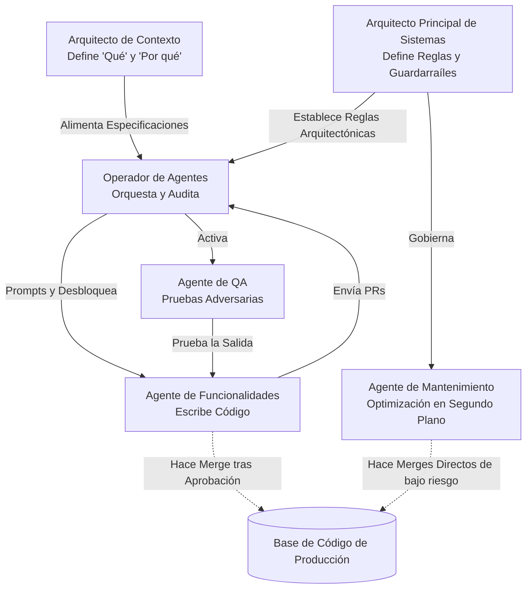

## Descripción general

El equipo de software tradicional — un grupo de humanos que dividen las tareas de código entre sí — está dando paso a una nueva formación. El Equipo Híbrido (Hybrid Squad) combina un pequeño núcleo humano con una flota de agentes de AI, cambiando el esfuerzo humano de la ejecución línea por línea a la orquestación, la arquitectura y la intención estratégica. Esta página explica cómo estructurar ese equipo, definir sus roles y conectarlo en una unidad de trabajo.

## Del Modelo de Fábrica al Modelo Director-Ejecutor

Las estructuras de equipo convencionales siguen lo que podríamos llamar el Modelo de Fábrica: el trabajo llega como tickets, los humanos los toman, escriben código, revisan el resultado de los demás y lo despliegan. Cada línea de código de producción pasa por manos humanas. Esto funcionaba cuando el código era el cuello de botella. Se descompone cuando los agentes de AI pueden generar, probar y refactorizar código más rápido de lo que los humanos pueden escribir.

El Modelo Director-Ejecutor invierte la proporción. La experiencia humana se concentra en tres actividades de alto impacto:

- **Orquestación** — decidiendo qué se construye, en qué orden y por quién (o qué)
- **Intención estratégica** — traduciendo los objetivos de negocio en especificaciones precisas sobre las cuales los agentes pueden actuar
- **Gobernanza arquitectónica** — estableciendo las reglas, límites y estándares de calidad que restringen la salida de los agentes

La Flota de Agentes se encarga de la ejecución de alto volumen: escribiendo código de implementación, ejecutando suites de pruebas, realizando migraciones y procesando refactorizaciones repetitivas. Los humanos dejan de ser el piso de la fábrica y comienzan a ser los directores, arquitectos y controladores de calidad.

Esto no se trata de reemplazar desarrolladores. Se trata de reconocer que los [[agentic-workflows]] cambian el lugar donde el juicio humano crea el mayor valor. Un ingeniero senior que revisa 20 pull requests generados por agentes al día entrega más impacto que ese mismo ingeniero escribiendo 2 pull requests a mano.

## Agentes de AI como Ejecutores Gestionados

En un Equipo Híbrido, los agentes de AI no son herramientas ad-hoc que se invocan — son ejecutores gestionados con responsabilidades definidas. Se les otorgan permisos de sistema, se les asignan tareas a través del backlog y se someten a seguimiento de rendimiento al igual que cualquier colaborador.

Este enfoque es importante porque cambia la forma en que se gestiona la calidad. En lugar de preguntar "¿la herramienta produjo una salida correcta?", se pregunta "¿este miembro del equipo está cumpliendo con sus estándares de rendimiento?". El rendimiento del agente se rastrea a través de métricas como:

- **Spec-to-Code Ratio** — ¿Con qué fidelidad la salida del agente coincide con la especificación que recibió? Una relación alta significa que el agente entendió la intención correctamente.
- **Correction Ratio** — ¿Cuántas intervenciones humanas son necesarias por cada ejecución del agente? Una relación baja indica que el agente puede trabajar de forma autónoma. Una relación alta señala que las specs, el context o los guardrails necesitan mejoras.

Cuando un agente tiene un rendimiento inferior de forma consistente, no se culpa al agente — se mejoran las entradas que recibe. Mejores especificaciones, un contexto más rico, restricciones arquitectónicas más estrictas. El mismo principio que se aplica a los miembros del equipo humanos se aplica aquí: una salida deficiente suele ser un problema de gestión, no un problema de talento.

## El Núcleo Humano

El lado humano de un Equipo Híbrido consta de tres roles. Cada uno se concentra en una dimensión diferente del Modelo Director-Ejecutor.

### Arquitecto Principal de Sistemas

El Arquitecto Principal de Sistemas es responsable de la integridad estructural de la codebase. No escribe la mayor parte del código — define las reglas arquitectónicas que rigen cómo se escribe el código.

Responsabilidades clave:

- **Ley arquitectónica** — Definiendo bounded contexts, module boundaries y integration contracts que los agentes deben respetar
- **Muestras Doradas (Golden Samples)** — Curando implementaciones de referencia que los agentes utilizan como plantillas para código nuevo. Una muestra dorada bien elegida enseña más a un agente que páginas de instrucciones.
- **Aplicación de límites de dominio (Domain boundary enforcement)** — Asegurando que el código generado por el agente respete la separation of concerns, no cree unwanted coupling y siga los patrones establecidos

El Arquitecto Principal de Sistemas opera río arriba de la ejecución. Su resultado son constraints, no código. Cuando un agente produce un pull request que viola los principios arquitectónicos, la causa raíz se remonta a una especificación arquitectónica incompleta o poco clara — no al agente mismo.

### Arquitecto de Contexto

El Arquitecto de Contexto reemplaza al Product Manager tradicional en un equipo basado en agentes. Mientras que un PM escribe user stories para desarrolladores humanos, el Arquitecto de Contexto practica la Ingeniería de Especificaciones (Spec Engineering) — traduciendo el "Por qué" del negocio en Live Specs legibles por máquina sobre las cuales los agentes pueden ejecutar.

Responsabilidades clave:

- **Ingeniería de Especificaciones (Spec Engineering)** — Produciendo especificaciones detalladas y estructuradas que incluyen acceptance criteria, edge cases y context references. Estas no son user stories vagas — son lo suficientemente precisas para que un [[autonomous-agent]] actúe sin ambigüedad.
- **Curación del Índice de Contexto (Context Index curation)** — Manteniendo la knowledge base de la que se nutren los agentes: API schemas, domain glossaries, decision logs y prior implementation patterns
- **Configuración de la compuerta [[human-in-the-loop]]** — Decidiendo qué tareas requieren aprobación humana antes del merge y cuáles pueden proceder de forma autónoma según el nivel de riesgo

La calidad de la salida del agente es directamente proporcional a la calidad del context que recibe. El Arquitecto de Contexto es el responsable de esa calidad de entrada.

### Operadores de Agentes

Los Operadores de Agentes son la evolución del Software Engineer. No pasan la mayor parte de su tiempo escribiendo código desde cero. En cambio, orquestan las Ejecuciones de Agentes (Agent Runs) — configurando, lanzando, monitoreando y auditando el trabajo que producen los agentes.

Responsabilidades clave:

- **Orquestación de agentes (Agent orchestration)** — Seleccionando el agente adecuado para cada tarea, configurando su context window y estableciendo los parámetros de ejecución
- **Agent recoveries** — Interviniendo cuando un agente se atasca en un loop, malinterpreta una spec o produce output que falla los tests. El Operador de Agentes diagnostica el failure, proporciona corrective context y re-lanza.
- **Auditorías finales (Final audits)** — Revisando los pull requests generados por agentes para verificar su correctness, security y alignment con los estándares arquitectónicos antes de aprobar los merges

Los Operadores de Agentes todavía escriben código — particularmente para componentes críticos del "Human-Owned Core" donde la tolerancia al riesgo es cero. Pero la mayor parte de su tiempo se desplaza a review, orchestration y quality assurance.

## La Flota de Agentes

El lado no humano del equipo consta de agentes especializados, cada uno diseñado para una clase de trabajo diferente.

### Agente de Mantenimiento

El Agente de Mantenimiento gestiona las tareas en segundo plano que consumen un tiempo de ingeniería desproporcionado: dependency upgrades, linting fixes, legacy code migration y configuration drift correction.

- **Nivel de supervisión:** Casi nulo. Estas tareas tienen inputs y outputs bien definidos con baja ambigüedad.
- **Autoridad de merge:** Puede hacer merge directamente para cambios de bajo riesgo (dependency patches, formatting fixes) con automated checks como única compuerta.
- **Valor:** Libera a los ingenieros humanos del "impuesto" de mantenimiento que típicamente consume del 20 al 40% de la capacidad del equipo.

### Agente de Funcionalidades

El Agente de Funcionalidades construye nueva functionality a partir de tickets del backlog. Opera on-demand — se inicia cuando un ticket está listo para la implementation y se apaga cuando se envía el pull request.

- **Nivel de supervisión:** Moderado. Opera en un Workbench seguro (sandboxed environment) con un modelo [[human-in-the-loop]]. El Operador de Agentes revisa el output antes del merge.
- **Flujo de trabajo:** Recibe un Paquete de Contexto (spec + architectural rules + golden samples), escribe implementation code, genera tests, itera hasta que los tests pasan y envía un PR para revisión humana.
- **Valor:** Gestiona el volumen de feature work que de otro modo requeriría un equipo de engineering más grande.

### Agente de QA

El Agente de QA sirve como una capa adversaria automatizada. En lugar de verificar si el código funciona para el happy path, intenta activamente romper cosas.

- **Nivel de supervisión:** Bajo. Su trabajo es sacar a la luz problems, no hacer merge de code.
- **Enfoque:** Genera edge-case inputs, stress-tests logic con datos inesperados, probes for race conditions y valida error handling paths.
- **Valor:** Atrapa la clase de bugs que los humanos pasan por alto porque inconscientemente prueban los caminos que esperan que funcionen. El Agente de QA no tiene tal bias — está diseñado para atacar. Trabaja junto con el proceso de [[ai-assisted-code-review]] para asegurar que el código generado por el agente cumpla con los quality standards.

## La Jerarquía del Equipo Híbrido

El siguiente diagrama muestra cómo fluyen la información y la autoridad a través del equipo:

Observen el flujo: las specifications y las architectural rules convergen en el Operador de Agentes, quien actúa como el control point para la agent execution. Los Agentes de Funcionalidades nunca hacen merge de su propio work — un Operador de Agentes debe approve. Los Agentes de Mantenimiento tienen un direct path a production para cambios preaprobados y de bajo risk. El Agente de QA crea un feedback loop que catches problems antes de que lleguen a review.

## El Flujo de Trabajo SDD

El Equipo Híbrido opera a través de un flujo de trabajo de Desarrollo Dirigido por Especificaciones (Spec-Driven Development, SDD) que se desarrolla en tres fases:

### 1. Refinamiento

El Arquitecto de Contexto y el Arquitecto Principal de Sistemas colaboran para producir un "Paquete de Contexto" (Context Packet) — un bundle de todo lo que el Agente de Funcionalidades necesita para ejecutar:

- La Live Spec con acceptance criteria y edge cases
- Architectural rules y constraints para el módulo relevante
- Muestras Doradas (Golden Samples) que muestran el expected code style y patterns
- Links a relevant domain context (API schemas, prior implementations)

El Refinamiento reemplaza la traditional sprint planning meeting. El output no es una list of tasks for humans — es un set of machine-executable specifications.

### 2. Ejecución

El Operador de Agentes alimenta el Paquete de Contexto al Agente de Funcionalidades, el cual:

- Escribe implementation code que coincide con la spec
- Genera test cases que cubren los specified acceptance criteria
- Ejecuta tests y corrige failures en un bucle cerrado
- Envía un pull request cuando todos los criteria pasan

Esta fase típicamente se completa en minutes rather than days. El agente trabaja continuously sin context switches, meetings o interruptions.

### 3. Revisión

El Operador de Agentes revisa el pull request del agente contra la original spec y architectural rules. Mientras tanto, el Ingeniero de Evaluación (Evaluation Engineer) (un specialized QA role cubierto en la next page) construye automated guardrails — test harnesses, constraint checks y evaluation rubrics — que validan el agent output at scale.

La Revisión en el Equipo Híbrido no se trata solo de correctness. Se trata de calibrar el system: identificar dónde las specs eran ambiguous, dónde las architectural rules necesitan tightening y dónde los agents necesitan better context. Cada review cycle mejora el next execution cycle.

## Lo Que Sigue

El Equipo Híbrido define la team structure. La siguiente página profundiza en los individual roles en detalle — lo que cada persona hace day-to-day, qué skills necesitan y cómo los traditional roles se corresponden con sus agentic counterparts.
