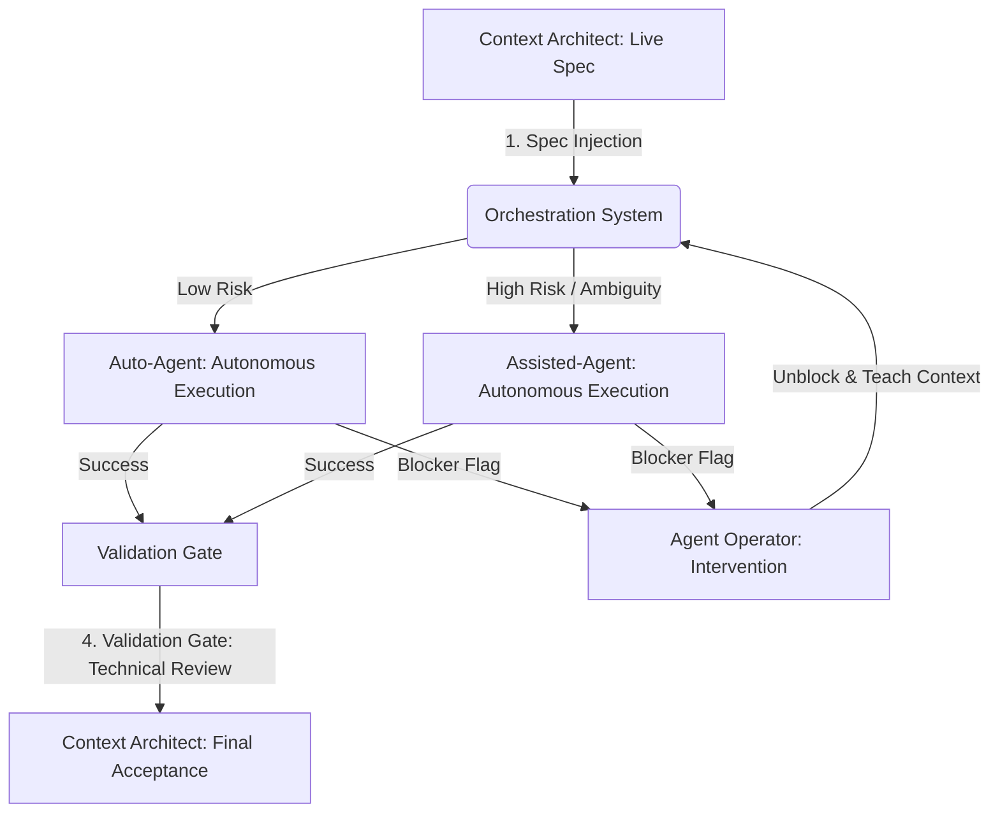

## Overview

The Orchestration Layer defines how work flows between humans and AI agents in [[agentic-engineering]]. It introduces a Triangular Workflow that replaces the traditional developer-centric model with three specialized roles and a four-phase escalation ladder that governs when and how tasks move between them.

## From Code to Intent

Traditional software development treats "writing code" as the primary unit of work. Agentic development redefines that unit as **defining precise business intent**. When intent is clear, unambiguous, and machine-readable, autonomous agents can execute at maximum velocity with minimal human intervention.

This shift makes [[context-engineering]] the highest-leverage activity in the development process. The clearer the context, the faster and more reliable the agent's output. Vague requirements no longer just slow down a human developer; they cause agents to hallucinate, loop, or produce subtly wrong implementations. Context clarity becomes the primary constraint on delivery speed.

The practical implication: teams that invest in precise specifications, well-structured context, and clear acceptance criteria will dramatically outperform teams that rely on agents to "figure it out."

## The Triangular Workflow

The Orchestration Layer is built on three specialized roles that form a continuous feedback triangle. Each role has a distinct responsibility and operates at a different level of abstraction.

### Context Architect

The Context Architect translates business needs into machine-readable specifications called Live Specs. This is the strategic role, concerned with the **Why** and the **What**. The Context Architect owns the problem definition, acceptance criteria, and the overall intent behind each unit of work.

Responsibilities include:

- Decomposing business requirements into discrete, well-scoped specs
- Defining acceptance criteria that agents can verify programmatically
- Maintaining the Context Index (the structured knowledge base agents draw from)
- Performing final acceptance of completed work

### The Agent

The Agent is the autonomous execution engine. It operates at the tactical level, focused entirely on the **How**. Given a Live Spec, the agent provisions an isolated workspace, implements the solution, and validates it against the spec's acceptance criteria.

Key characteristics:

- Works within an isolated Workbench (ephemeral, sandboxed environment)
- Follows the spec deterministically rather than making architectural decisions
- Self-validates against automated evaluation criteria
- Raises a Blocker Flag when it encounters ambiguity or hits a constraint it cannot resolve

### Agent Operator

The Agent Operator provides [[human-in-the-loop]] oversight. This role serves as the escalation path for situations that exceed the agent's capabilities: high-ambiguity problems, architectural edge cases, security-sensitive decisions, and novel situations not covered by existing context.

Responsibilities include:

- Responding to Blocker Flags from agents ("Rescue Missions")
- Debugging agent failures and updating context to prevent recurrence
- Validating architectural decisions and security implications
- Enriching the Context Index with lessons learned from interventions

## The Four-Phase Escalation Ladder

Work moves through four distinct phases, with clear handoff points and [[guardrails]] at each transition.

### Phase 1: Intent Orchestration

The Context Architect submits a Live Spec to the Orchestration System. The system performs automated triage, routing the task based on risk profile and complexity:

- **Low-risk tasks** (well-defined scope, existing patterns, low blast radius) route directly to an Auto-Agent for fully autonomous execution.
- **High-risk or ambiguous tasks** (new patterns, security-sensitive changes, cross-cutting concerns) route to an Assisted-Agent that works under closer operator supervision.

### Phase 2: Autonomous Execution

The agent provisions an Ephemeral Workbench, a sandboxed environment that contains everything needed to execute the task. It implements the solution, then validates the result against the Eval Harness, a suite of automated checks defined in the spec.

If all checks pass, the work moves to the Validation Gate. If the agent encounters a blocker it cannot resolve, it raises a Blocker Flag and the work escalates to Phase 3.

### Phase 3: Context Refinement

When an agent raises a Blocker Flag, the Agent Operator intervenes in what is called a "Rescue Mission." The operator diagnoses the issue, which typically falls into one of these categories:

- **Ambiguous spec** —the intent was unclear or incomplete
- **Missing context** —the agent lacked information it needed
- **Novel problem** —no existing pattern covers this scenario
- **Constraint conflict** —requirements contradict each other

The operator resolves the blocker, updates the Context Index with the new knowledge, and returns the task to the Orchestration System. This creates a feedback loop: every intervention makes the system smarter and reduces future escalations.

### Phase 4: Final Acceptance Gate

Completed work passes through a Technical Review that evaluates:

- **Security** —no new vulnerabilities, secrets properly handled, access controls intact
- **Maintainability** —code follows established patterns, is well-documented, and is testable
- **Architectural fit** —changes align with system architecture and do not introduce unintended coupling

The Context Architect performs final acceptance, confirming that the implementation satisfies the original business intent.

## The Orchestration Flow

The following diagram illustrates how work flows through the four phases, with the Orchestration System routing tasks based on risk and the Agent Operator providing intervention when needed.

This flow creates a self-improving system. Each cycle through the escalation ladder enriches the Context Index, tightens the Eval Harness, and reduces the proportion of tasks that require human intervention over time.

## The Context-Decision-Learning Cycle

Underlying the Triangular Workflow is a continuous feedback loop that drives improvement across every iteration:

1. **Context** —The Context Architect provides structured knowledge (Live Specs, Context Index) that defines what needs to happen and why.
2. **Decision** —The Agent (or Agent Operator, when escalated) makes tactical decisions about how to implement the intent within the given constraints.
3. **Learning** —Every execution, whether successful or escalated, generates new knowledge that feeds back into the Context Index, refining future context and reducing ambiguity.

This cycle means the system gets progressively better at autonomous execution. Early on, many tasks escalate to the Agent Operator. Over time, as context accumulates and specs become more precise, the proportion of fully autonomous executions increases.

## Designing for [[agentic-workflows]]

When implementing the Orchestration Layer, keep these principles in mind:

- **Specs are first-class artifacts.** Treat Live Specs with the same rigor as production code. Version them, review them, test them.
- **Isolation is non-negotiable.** Every agent execution must happen in an ephemeral, sandboxed workbench. Never let agents modify shared state directly.
- **Escalation is a feature, not a failure.** Blocker Flags are the system working correctly. Optimize for fast, informative escalations rather than trying to eliminate them entirely.
- **Context compounds.** Every operator intervention should produce a reusable context update. If you solve the same problem twice without updating the Context Index, you have a process gap.

## Next Steps

With the Orchestration Layer in place, the next page covers the [Core Pillars](/en/handbook/framework/core-pillars) that provide the architectural foundation for agentic teams.
