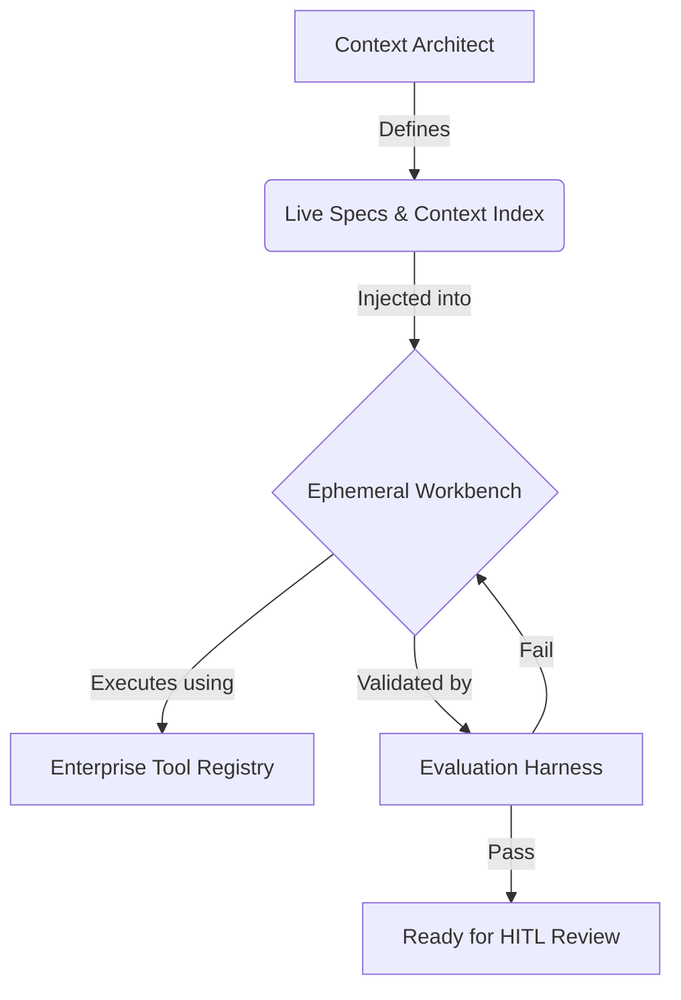

## Overview

Context is the primary constraint of agentic development. The quality of every agent execution is bounded not by model capability but by the clarity, completeness, and freshness of the context it receives. This page covers the Context-First Architecture, the Context Index that serves as the agent's institutional memory, Live Specs that package requirements into machine-readable blueprints, and the hygiene practices that keep context healthy over time.

## Context-First Architecture

In traditional development, the primary constraint is developer time. There are always more tasks than engineers to complete them. In agentic development, the constraint shifts: models can generate code faster than humans, but only when they have precise, well-structured input to work from.

This is the core principle of [[context-engineering]]: context is code. The context you provide to an agent is not supplementary documentation —it is the primary input that determines output quality. A mediocre model with excellent context outperforms a frontier model with vague context.

### Context Clarity as the Primary Constraint

When agents have precise, complete, and well-structured context, they execute reliably and fast. When context is vague, incomplete, or contradictory, they produce hallucinations, miss edge cases, loop unproductively, or generate code that technically works but violates architectural intent.

This means the [[context-window]] is not just a technical limitation of language models. It is an architectural constraint that shapes how you:

- **Decompose work** —Tasks must be scoped so that all relevant context fits within the model's window.
- **Structure specifications** —Specs must be self-contained, referencing only what the agent needs for the current task.
- **Organize knowledge** —The Context Index must be retrievable in targeted slices, not served as a monolithic dump.

### The Context = Code Principle

Treat context artifacts with the same rigor you apply to source code:

- **Version-controlled** —Context lives in the repository alongside the code it describes.
- **Reviewed** —Changes to specs, architectural rules, and domain glossaries go through pull requests.
- **Tested** —Validation checks confirm that context is internally consistent and references resolve correctly.
- **Maintained** —Stale context is archived or updated on a regular cadence.

Organizations that treat context as a first-class engineering artifact see measurably better agent performance than those that treat it as informal documentation.

## The Context Index

The Context Index is the curated knowledge base that agents draw from during execution. It is the structured sum of everything the organization knows about its systems, standards, and practices —organized for machine consumption.

### What the Context Index Contains

The Context Index typically includes:

- **Live Specs** —Machine-readable specifications for current and recent work items
- **System Constitution** —Architectural principles, coding standards, security policies, and domain rules
- **Codebase context** —Type definitions, API schemas, test suites, and inline documentation
- **Domain glossary** —Definitions of business terms, abbreviations, and domain-specific language
- **Historical context** —Past decisions, resolved blockers, lessons learned, and postmortem findings
- **Golden Samples** —Reference implementations that demonstrate the correct way to build each type of component

### Retrieval with RAG

For non-trivial codebases, the Context Index is too large to inject into a single prompt. [[rag|RAG]] (Retrieval-Augmented Generation) patterns solve this by dynamically retrieving only the context slices relevant to the current task.

A well-implemented RAG pipeline:

1. **Indexes** the Context Index into a vector store, chunked and embedded for semantic similarity search.
2. **Queries** the store at execution time using the task description, spec content, and relevant code references.
3. **Injects** the retrieved context into the agent's [[system-prompt]] or working memory alongside the task instructions.
4. **Ranks** results by relevance, recency, and authority to ensure the agent sees the most useful context first.

RAG reduces the burden on the Context Architect (who no longer needs to manually select context for every task) and increases the proportion of tasks that agents handle autonomously.

### Poisonous Context

Not all context is helpful. Poisonous Context is outdated, conflicting, or misleading information that persists in the Context Index and causes agents to produce incorrect output.

Common sources of poisonous context:

- **Stale documentation** —API docs that describe endpoints that no longer exist, or architectural guides that reference deprecated patterns.
- **Conflicting standards** —Two documents that prescribe different approaches to the same problem. The agent follows one and violates the other.
- **Legacy examples** —Old code samples that use patterns the team has since abandoned. Agents treat these as authoritative precedent.
- **Unresolved decision records** —ADRs marked as "proposed" that agents interpret as "accepted."

Poisonous context is insidious because its effects look like [[hallucination]]. The agent confidently generates code that follows the wrong pattern —not because it hallucinated, but because it faithfully followed bad input. The fix is not a better model; it is cleaner context.

## Live Specs

A Live Spec is a structured, executable requirements package that serves as the primary input to agent execution. Unlike a traditional user story or ticket description, a Live Spec is precise enough that an agent can implement it without asking clarifying questions and verify its own work against the defined acceptance criteria.

### Anatomy of a Live Spec

Every Live Spec is a package containing four components:

1. **User Intent** —A clear statement of what the user or business needs, expressed in terms of the desired outcome rather than implementation details.
2. **Context Slice** —The specific subset of the Context Index relevant to this task: related code files, API schemas, architectural rules, and domain definitions.
3. **Constraint Map** —Explicit boundaries on the solution: which patterns to use, which patterns to avoid, performance thresholds, security requirements, and compatibility constraints.
4. **Validation Gate** —Executable acceptance criteria that the agent must satisfy before the task is considered complete. These are automated checks, not prose descriptions.

### The Three Minimum Assets

At a minimum, every spec must contain three assets:

1. **Behavioral Contract** —A precise description of the expected behavior, including inputs, outputs, edge cases, and error handling. This is what the agent implements. The contract should be specific enough that two independent agents, given the same contract, would produce functionally equivalent implementations.

2. **System Constitution** —The constraints that govern how the agent operates for this task. This includes coding standards, architectural patterns, security policies, and any domain-specific rules. The constitution defines the boundaries of acceptable solutions.

3. **Actionable Task Map** —A decomposed, ordered list of implementation steps the agent follows. Each step references the relevant section of the Behavioral Contract and includes its own micro-acceptance criteria. The task map ensures the agent works incrementally and validates each step before proceeding to the next.

### Version Control and Modularity

Live Specs are version-controlled artifacts that live in the repository alongside the code they describe:

- **Versioned** —Every spec change is tracked in Git with full history. You can always see what the spec looked like when a particular implementation was generated.
- **Modular** —Large features are decomposed into multiple specs that reference each other. Each spec is self-contained enough for independent agent execution.
- **Executable** —Acceptance criteria are written as automated checks. The agent does not need a human to tell it whether the criteria are met.
- **Evolving** —Specs are updated as requirements change, implementation reveals new edge cases, or the system architecture shifts. A spec is never "done" —it evolves with the codebase.

## How It Fits Together

The following diagram illustrates the flow from context management through agent execution:

The Context Architect defines and maintains both the Live Specs and the Context Index. When a task is dispatched, the relevant spec and context slice are injected into an Ephemeral Workbench. The agent executes using tools from the Enterprise Tool Registry. Its output is validated by the Evaluation Harness. If evaluation passes, the result moves to human review. If evaluation fails, the agent receives feedback and retries within the same workbench.

## Context Hygiene

Context is a living asset that degrades without active maintenance. Organizations that invest in context hygiene see sustained agent performance. Those that do not see gradual quality erosion as the Context Index fills with stale and conflicting information.

### The Monthly Hygiene Cycle

Adopt a monthly cadence for context maintenance:

1. **Audit** —Review the Context Index for staleness. Flag any documents, specs, or examples that have not been updated in the past quarter. Cross-reference with recent code changes to identify context that has drifted from reality.
2. **Archive** —Move obsolete documentation, completed specs, and deprecated examples to an archive. Archived context is excluded from RAG retrieval but preserved for historical reference.
3. **Pin** —Identify new standards, patterns, or decisions adopted in the past month. Pin these as authoritative entries in the Context Index so they take precedence in retrieval.
4. **Validate** —Run automated consistency checks across the Context Index. Look for conflicting guidance, broken references, and duplicate entries.

### Ownership

Context hygiene works best when it has clear ownership. The Context Architect is responsible for the overall health of the Context Index, but individual domains should have designated maintainers —the engineers who know the code and can judge whether context is still accurate.

### Warning Signs

Watch for these indicators that context hygiene is slipping:

- Agent output quality declining on previously well-handled task types
- Agents generating code that uses deprecated patterns
- Increasing frequency of human corrections during review
- Conflicting implementations across different features that should follow the same pattern

## What Comes Next

With context management in place, the next question is: how do you know that agent output meets your standards? The next page covers the Evaluation Harness —the automated testing, quality gates, and governance mechanisms that validate everything agents produce.
