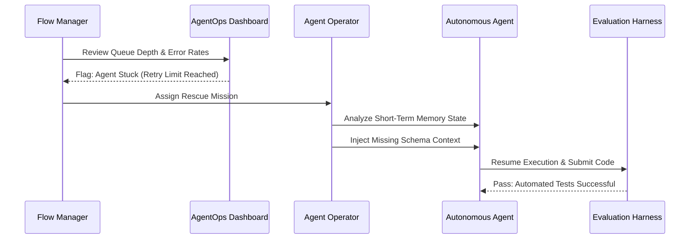

## Overview

Traditional Scrum ceremonies were designed for human teams working in two-week sprints. Agentic development operates at a fundamentally different tempo — agents generate code in minutes, not days, and the volume of output overwhelms review processes built for human-paced delivery. This page defines the governance routines that replace traditional ceremonies, organized by cadence from quarterly strategy down to real-time execution.

## Why Traditional Ceremonies Break Down

Scrum ceremonies assume a predictable rhythm: plan for two weeks, execute, review, retrospect. Three properties of [[agentic-workflows]] invalidate this assumption:

- **Speed** — An agent can produce a working pull request in minutes. A two-week sprint cadence introduces artificial delays between specification and delivery.
- **Volume** — A single Agent Operator supervising multiple agents generates more output in a day than a traditional developer produces in a sprint. Review ceremonies designed for 5-10 PRs per sprint cannot handle 50+ per day.
- **Unpredictability of output** — Agent-generated code varies in quality based on context quality, not effort invested. Some tasks complete perfectly on the first run. Others require multiple intervention cycles. Planning ceremonies that assume uniform task sizing produce inaccurate forecasts.

The replacement is not fewer ceremonies — it is ceremonies at the right cadence, with the right participants, focused on the activities that actually govern agent-driven execution.

## Quarterly and Monthly: Strategic Alignment and System Health

### Strategic Spec Definition (Quarterly)

The highest-level governance routine translates product vision into machine-executable work. The Context Architect owns this ceremony.

**Purpose:** Decompose the product roadmap into Epics, draft high-level Live Specs for each Epic, and define [[human-in-the-loop]] gates that determine which tasks require human approval during execution.

**Activities:**

1. Review the product roadmap and identify the Epics for the upcoming quarter.
2. For each Epic, draft a high-level Live Spec that captures intent, scope, acceptance criteria, and architectural constraints.
3. Assign risk levels to each Epic and configure HITL gates accordingly — low-risk Epics may flow through with minimal human review, while high-risk Epics require Agent Operator approval at every stage.
4. Identify dependencies between Epics and sequence them to minimize blocking.

**Output:** A prioritized Epic backlog with draft Live Specs and HITL gate configurations, ready for decomposition into weekly work.

**Agile equivalent:** Quarterly Planning / PI Planning.

### System Maintenance Cycles (Monthly)

Monthly routines focus on system health — ensuring that the infrastructure, context, and economics of agent execution remain sound. Four activities run in parallel, each owned by a different role:

### Boundary Audit (Principal Architect)

Review domain boundaries for integrity. As agents generate code at scale, architectural drift accumulates — modules develop unwanted dependencies, bounded contexts leak, and naming conventions erode. The Boundary Audit catches this drift before it compounds.

- Run automated architecture constraint tests across the full codebase.
- Flag any new violations introduced since the last audit.
- Update Golden Samples if patterns have evolved.

### Context Hygiene Cycle (Context Architect)

Audit the Context Index for staleness, redundancy, and gaps. Agent output quality degrades when the knowledge base they draw from contains outdated information or missing context.

- Remove deprecated API schemas, outdated decision logs, and stale documentation.
- Add new context entries for recently introduced systems, APIs, or domain concepts.
- Validate that Live Specs reference current, accurate context sources.

### FinOps and ROI Review (Flow Manager)

Analyze the economics of agent execution over the past month. Track cost per feature, token consumption trends, and the ratio of agent-generated value to compute spend.

- Identify tasks where agent execution cost exceeded the value delivered.
- Flag runaway token consumption patterns and implement budget guardrails.
- Report blended efficiency metrics to stakeholders.

### Platform Capability Release (Agent Platform Engineering)

Ship infrastructure improvements to the agent execution environment — new tool integrations, sandbox security updates, and performance optimizations.

- Deploy updated tool definitions and MCP server configurations.
- Roll out security patches to the Workbench Runtime.
- Update network egress policies based on new integration requirements.

## Weekly: Tactical Planning and Governance

Weekly routines form the operational heartbeat of the Hybrid Squad. They replace the Sprint Planning / Sprint Review / Retrospective cycle with activities tuned for agent-driven execution.

### Specification Engineering Block

**Replaces:** Backlog Refinement

The Context Architect and Principal Systems Architect collaborate to produce Context Packets — the bundles of specifications, architectural rules, golden samples, and domain context that agents need to execute tasks.

**Activities:**

1. Select the highest-priority tasks from the Epic backlog.
2. For each task, draft a detailed Live Spec with acceptance criteria, edge cases, and input/output contracts.
3. Attach relevant Golden Samples and architectural constraints.
4. Package everything into a Context Packet ready for agent consumption.

**Output:** A set of Context Packets, each containing everything an agent needs to produce a working implementation.

The quality of this block determines the quality of the entire week's agent output. Rushing specification engineering to "get agents working faster" is the most common and most costly mistake teams make.

### Context and Allocation Planning

**Replaces:** Sprint Planning

The Context Architect and Flow Manager triage task complexity, route work to the appropriate executor, and set the weekly Token Budget.

**Activities:**

1. Classify each task as **Agent-Ready** (sufficient context, clear spec, well-defined boundaries) or **Human-First** (ambiguous requirements, security-critical, requires novel architectural decisions).
2. Route Agent-Ready tasks to the appropriate agent type: Feature Agent for new functionality, Maintenance Agent for upgrades and migrations.
3. Route Human-First tasks to Agent Operators for manual implementation.
4. Set the weekly Token Budget — the maximum compute spend authorized for agent execution. This prevents runaway costs and forces prioritization.

**Output:** A task allocation plan with clear routing decisions and a defined Token Budget.

### Architecture Governance Review

**Replaces:** Tech Design Review

The Principal Systems Architect reviews and approves (or rejects) architectural designs before agents generate significant code. This is a gate, not a discussion — designs that violate architectural principles are rejected and returned for revision.

**Activities:**

1. Review proposed designs for upcoming agent tasks.
2. Verify that designs respect bounded context boundaries and dependency rules.
3. Approve designs that comply with architectural standards.
4. Reject designs that would introduce structural debt, with specific guidance on corrections needed.

**Output:** A set of approved designs ready for agent execution, and a set of rejected designs with revision instructions.

This review prevents the most expensive class of agent error: structurally sound code that violates architectural principles. An agent can produce a perfectly functional module that creates unwanted coupling between domains. Catching this before execution saves orders of magnitude more effort than fixing it after.

### Increment Validation and System Retrospective

**Replaces:** Sprint Review

The team reviews the week's output in Preview Environments — deployed, running instances of agent-generated code — and evaluates system performance.

**Activities:**

1. Demo completed features in Preview Environments, not just code diffs.
2. Evaluate **Outcome Verification** (does the feature deliver business value?) rather than just **Output Verification** (did the agent produce passing code?). A feature can pass all tests and still fail to deliver what the business actually needs.
3. Review agent performance metrics: Spec-to-Code Ratio, Correction Ratio, and Token Budget adherence.
4. Identify systemic improvements: specs that need more detail, architectural rules that need tightening, context gaps that caused agent failures.

**Output:** Validated increments ready for production, and a list of systemic improvements for the next cycle.

## Daily: Execution and the Agent Operator

Daily routines focus on real-time execution. The goal is to keep agents productive and unblocked, intervening precisely when and where human judgment is needed.

### Daily Flow Sync

**Replaces:** Daily Standup

The Flow Manager leads a brief review of the AgentOps Dashboard — the real-time monitoring interface that tracks agent execution status across the squad.

**Activities:**

1. Review queue depth: how many tasks are waiting for agent execution, and how many are in progress?
2. Check wait times: are any tasks stalled waiting for context, review, or infrastructure?
3. Monitor error rates: are agents failing at higher rates than normal, indicating a systemic issue with context quality or infrastructure?
4. Identify stuck agents — those that have exceeded retry limits or entered loops — and assign Rescue Missions to Agent Operators.

**Duration:** 10-15 minutes. This is a status check, not a discussion forum.

**Output:** A clear picture of pipeline health and a list of assigned Rescue Missions.

### Real-Time Execution: The Rescue Mission

When an agent gets stuck — looping on a failing test, misinterpreting a spec, or producing output that violates architectural constraints — an Agent Operator executes a Rescue Mission.

**The Rescue Mission workflow:**

1. **Diagnose** — The operator examines the agent's short-term memory: what context did it receive? What steps did it take? Where did it diverge from the expected path?
2. **Inject** — The operator provides the missing piece: a corrected schema reference, an explicit constraint the agent overlooked, a clarification of ambiguous spec language. This is [[context-engineering]] applied in real time.
3. **Resume** — The agent resumes execution with the injected context and continues toward completion.

Rescue Missions are the highest-priority daily activity. Every minute an agent spends stuck is a minute of wasted compute and blocked pipeline throughput.

### Enforcing the Token Budget

The Token Budget set during weekly planning is not advisory — it is a hard constraint. The Flow Manager monitors cumulative token consumption throughout the day and makes allocation decisions when the budget comes under pressure.

**When budget is on track:** Agents continue executing tasks in priority order.

**When budget is under pressure:** The Flow Manager must choose between two options:

1. **Allocate more tokens** — Request a budget increase from the weekly allocation. This requires justification: which tasks are consuming more than expected, and why?
2. **Manually author final code** — For tasks where the agent has produced 80-90% of the solution but is consuming excessive tokens on the last mile, an Agent Operator takes over and completes the work manually. This is often the most cost-effective choice for complex edge cases.

The Token Budget prevents the most common failure mode in agentic teams: runaway agent loops that consume thousands of dollars in compute while producing no incremental value.

## Consolidated Framework Routines

The following table maps every governance routine to its frequency, owner, purpose, and traditional Agile equivalent:

| Frequency | Event Name | Owner | Activity and Purpose | Agile Equivalent |
| :---- | :---- | :---- | :---- | :---- |
| Quarterly | Strategic Spec Definition | Context Architect | Decompose Vision into Epics, draft Live Specs, set HITL gates. | Quarterly Planning |
| Monthly | Boundary Audit and FinOps | Principal Architect / Flow Mgr | Review domain integrity and compute ROI per feature. | Architecture / Budget Review |
| Weekly | Context and Allocation Planning | Context Architect | Triage task complexity, route work, set weekly Token Budget. | Sprint Planning |
| Weekly | Architecture Governance | Principal Architect | Approve designs before Agents generate significant code. | Tech Design Review |
| Daily | Daily Flow Sync | Flow Manager | Identify stuck Agents, assign Rescue Missions, unblock queues. | Daily Standup |

## What Comes Next

The next page presents a complete end-to-end case study showing how these routines work together in practice — from quarterly epic definition through daily agent execution, including a rescue mission. After that, the final page covers the metrics and success tracking frameworks that measure whether these routines are actually working.
