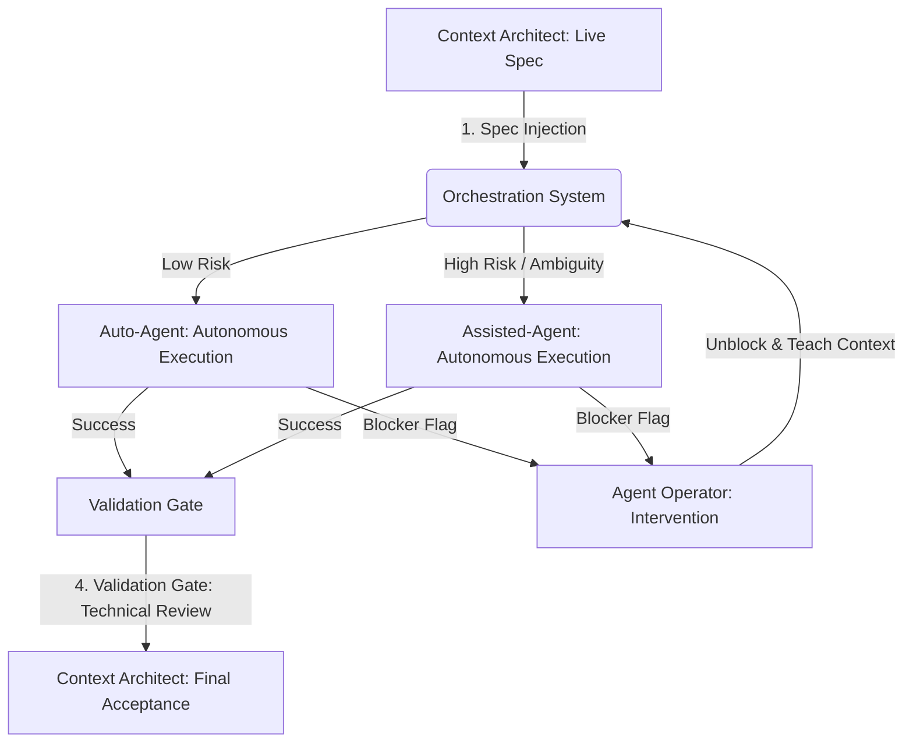

## Visão Geral

A Camada de Orquestração define como o trabalho flui entre humanos e **AI** agents em [[agentic-engineering]]. Ela introduz um Fluxo de Trabalho Triangular que substitui o modelo tradicional centrado no desenvolvedor por três papéis especializados e uma escada de escalonamento de quatro fases que governa quando e como as tarefas se movem entre eles.

## Do Código à Intenção

O desenvolvimento de software tradicional trata "escrever código" como a unidade primária de trabalho. O desenvolvimento **agentic** redefine essa unidade como **definir uma intenção de negócio precisa**. Quando a intenção é clara, não ambígua e legível por máquina, os **agents** autônomos podem executar na velocidade máxima com mínima intervenção humana.

Essa mudança torna a [[context-engineering]] a atividade de maior alavancagem no processo de desenvolvimento. Quanto mais claro o **context**, mais rápida e confiável a saída do **agent**. Requisitos vagos não apenas atrasam um desenvolvedor humano; eles fazem com que os **agents** alucinem, entrem em loop ou produzam implementações sutilmente erradas. A clareza do **context** torna-se a principal restrição na velocidade de entrega.

A implicação prática: equipes que investem em especificações precisas, **context** bem estruturado e critérios de aceitação claros superarão drasticamente as equipes que dependem de **agents** para "descobrir".

## O Fluxo de Trabalho Triangular

A Camada de Orquestração é construída sobre três papéis especializados que formam um triângulo de feedback contínuo. Cada papel tem uma responsabilidade distinta e opera em um nível diferente de abstração.

### Context Architect

O **Context Architect** traduz as necessidades de negócio em especificações legíveis por máquina chamadas Live Specs. Este é o papel estratégico, preocupado com o **Porquê** e o **O quê**. O **Context Architect** é responsável pela definição do problema, pelos critérios de aceitação e pela intenção geral por trás de cada unidade de trabalho.

As responsabilidades incluem:

- Decompor os requisitos de negócio em **specs** discretas e bem delimitadas
- Definir critérios de aceitação que os **agents** podem verificar programaticamente
- Manter o **Context** Index (a base de conhecimento estruturada da qual os **agents** se baseiam)
- Realizar a aceitação final do trabalho concluído

### O Agent

O **Agent** é o motor de execução autônomo. Ele opera no nível tático, focado inteiramente no **Como**. Dada uma Live Spec, o **agent** provisiona um espaço de trabalho isolado, implementa a solução e a valida em relação aos critérios de aceitação da **spec**.

Características chave:

- Trabalha em um Workbench isolado (ambiente efêmero e em **sandbox**)
- Segue a **spec** deterministicamente, em vez de tomar decisões arquitetônicas
- Auto-valida-se em relação aos critérios de avaliação automatizados
- Levanta uma Blocker Flag quando encontra ambiguidade ou atinge uma restrição que não consegue resolver

### Agent Operator

O **Agent Operator** fornece supervisão [[human-in-the-loop]]. Este papel serve como o caminho de escalonamento para situações que excedem as capacidades do **agent**: problemas de alta ambiguidade, casos extremos arquitetônicos, decisões sensíveis à segurança e situações novas não cobertas pelo **context** existente.

As responsabilidades incluem:

- Responder a Blocker Flags de **agents** ("Agent Recoveries")
- Debugar falhas de **agent** e atualizar o **context** para prevenir recorrências
- Validar decisões arquitetônicas e implicações de segurança
- Enriquecer o **Context** Index com lições aprendidas das intervenções

## A Escada de Escalonamento de Quatro Fases

O trabalho se move por quatro fases distintas, com pontos de entrega claros e [[guardrails]] em cada transição.

### Fase 1: Orquestração de Intenção

O **Context Architect** envia uma Live Spec para o Sistema de Orquestração. O sistema realiza a triagem automatizada, roteando a tarefa com base no perfil de risco e complexidade:

- **Tarefas de baixo risco** (**scope** bem definido, padrões existentes, baixo raio de impacto) são roteadas diretamente para um Auto-**Agent** para execução totalmente autônoma.
- **Tarefas de alto risco ou ambíguas** (novos padrões, mudanças sensíveis à segurança, preocupações transversais) são roteadas para um Assisted-**Agent** que trabalha sob supervisão mais próxima do **operator**.

### Fase 2: Execução Autônoma

O **agent** provisiona um Ephemeral Workbench, um ambiente em **sandbox** que contém tudo o que é necessário para executar a tarefa. Ele implementa a solução e, em seguida, valida o resultado em relação ao Eval Harness, um conjunto de verificações automatizadas definidas na **spec**.

Se todas as verificações forem aprovadas, o trabalho passa para o Validation Gate. Se o **agent** encontrar um **blocker** que não consegue resolver, ele levanta uma Blocker Flag e o trabalho é escalado para a Fase 3.

### Fase 3: Refinamento de Context

Quando um **agent** levanta uma Blocker Flag, o **Agent Operator** intervém no que é chamado de "Agent Recovery". O **operator** diagnostica o problema, que geralmente se enquadra em uma dessas categorias:

- **Spec** ambígua — a intenção era pouco clara ou incompleta
- **Context** ausente — o **agent** não tinha as informações de que precisava
- Problema novo — nenhum padrão existente cobre este cenário
- Conflito de restrição — os requisitos se contradizem

O **operator** resolve o **blocker**, atualiza o **Context** Index com o novo conhecimento e retorna a tarefa ao Sistema de Orquestração. Isso cria um loop de feedback: cada intervenção torna o sistema mais inteligente e reduz futuros escalonamentos.

### Fase 4: Final Acceptance Gate

O trabalho concluído passa por uma Revisão Técnica que avalia:

- **Security** — sem novas vulnerabilidades, **secrets** tratados corretamente, controles de acesso intactos
- **Maintainability** — o código segue padrões estabelecidos, é bem documentado e é testável
- **Architectural fit** — as alterações se alinham com a arquitetura do sistema e não introduzem acoplamento não intencional

O **Context Architect** realiza a aceitação final, confirmando que a implementação satisfaz a intenção de negócio original.

## O Fluxo de Orquestração

O diagrama a seguir ilustra como o trabalho flui pelas quatro fases, com o Sistema de Orquestração roteando tarefas com base no risco e o **Agent Operator** fornecendo intervenção quando necessário.

Este fluxo cria um sistema autoaperfeiçoável. Cada ciclo pela escada de escalonamento enriquece o **Context** Index, aperta o Eval Harness e reduz a proporção de tarefas que exigem intervenção humana ao longo do tempo.

## O Ciclo Context-Decisão-Aprendizado

Subjacente ao Fluxo de Trabalho Triangular está um loop de feedback contínuo que impulsiona a melhoria em cada iteração:

1. **Context** — O **Context Architect** fornece conhecimento estruturado (Live Specs, **Context** Index) que define o que precisa acontecer e por quê.
2. **Decision** — O **Agent** (ou **Agent Operator**, quando escalado) toma decisões táticas sobre como implementar a intenção dentro das restrições dadas.
3. **Learning** — Cada execução, seja bem-sucedida ou escalada, gera novo conhecimento que alimenta o **Context** Index, refinando o **context** futuro e reduzindo a ambiguidade.

Este ciclo significa que o sistema melhora progressivamente na execução autônoma. No início, muitas tarefas escalam para o **Agent Operator**. Com o tempo, à medida que o **context** se acumula e as **specs** se tornam mais precisas, a proporção de execuções totalmente autônomas aumenta.

## Projetando para [[agentic-workflows]]

Ao implementar a Camada de Orquestração, mantenha esses princípios em mente:

- **Specs** são artefatos de primeira classe. Trate as Live Specs com o mesmo rigor que o código de produção. Versionadas, revisadas, testadas.
- O isolamento é inegociável. Toda execução de **agent** deve ocorrer em um **workbench** efêmero e em **sandbox**. Nunca permita que os **agents** modifiquem o estado compartilhado diretamente.
- O escalonamento é um recurso, não uma falha. Blocker Flags são o sistema funcionando corretamente. Otimize para escalonamentos rápidos e informativos, em vez de tentar eliminá-los completamente.
- O **context** se acumula. Cada intervenção do **operator** deve produzir uma atualização de **context** reutilizável. Se você resolver o mesmo problema duas vezes sem atualizar o **Context** Index, você tem uma lacuna no processo.

## Próximos Passos

Com a Camada de Orquestração em vigor, a próxima página aborda os [Core Pillars](/en/handbook/framework/core-pillars) que fornecem a base arquitetônica para equipes **agentic**.
