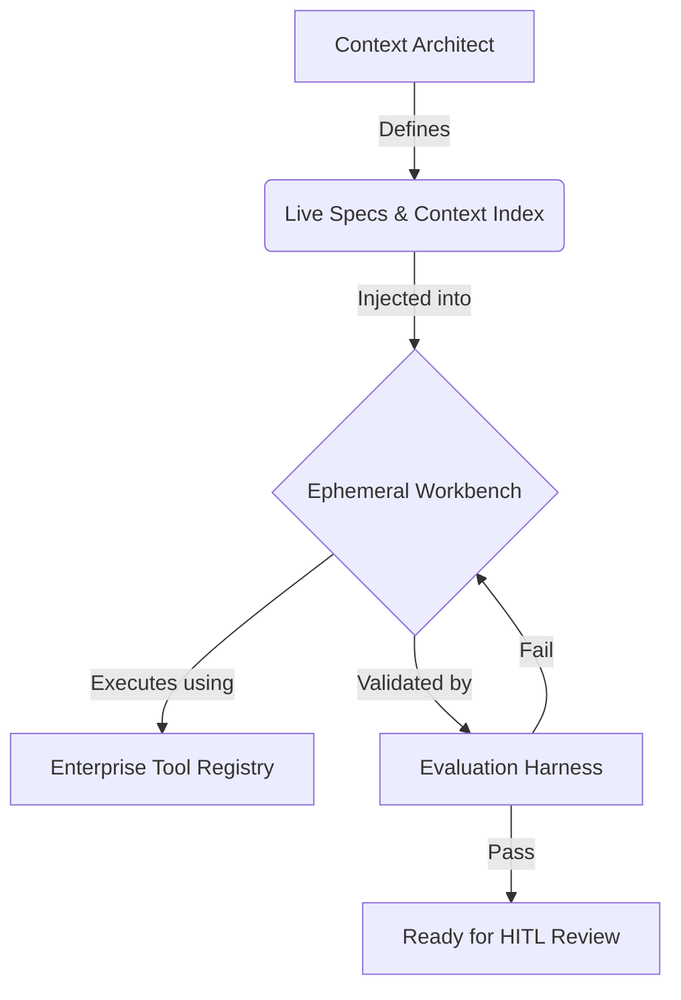

## Visão Geral

O contexto é a principal restrição do desenvolvimento agentico. A qualidade de cada execução de agent não é limitada pela capacidade do modelo, mas pela clareza, completude e atualidade do contexto que ele recebe. Esta página aborda a Arquitetura Context-First, o Context Index que serve como memória institucional do agent, os Live Specs que empacotam os requisitos em blueprints legíveis por máquina e as práticas de higiene que mantêm o contexto saudável ao longo do tempo.

## Arquitetura Context-First

No desenvolvimento tradicional, a principal restrição é o tempo do desenvolvedor. Sempre há mais tarefas do que engenheiros para completá-las. No desenvolvimento agentico, a restrição muda: os modelos podem gerar código mais rápido que os humanos, mas apenas quando têm uma entrada precisa e bem estruturada para trabalhar.

Este é o princípio central da [[context-engineering]]: o contexto é código. O contexto que você fornece a um agent não é documentação suplementar —é a entrada primária que determina a qualidade da saída. Um modelo medíocre com excelente contexto supera um modelo de ponta com contexto vago.

### Clareza do Contexto como a Principal Restrição

Quando os agents têm contexto preciso, completo e bem estruturado, eles executam de forma confiável e rápida. Quando o contexto é vago, incompleto ou contraditório, eles produzem [[hallucination]], perdem casos de borda, entram em loop improdutivo ou geram código que tecnicamente funciona, mas viola a intenção arquitetural.

Isso significa que o [[context-window]] não é apenas uma limitação técnica dos LLMs. É uma restrição arquitetural que molda como você:

- **Decompõe o trabalho** —As tarefas devem ser delimitadas de forma que todo o contexto relevante caiba na window do modelo.
- **Estrutura especificações** —As Specs devem ser autocontidas, referenciando apenas o que o agent precisa para a tarefa atual.
- **Organiza o conhecimento** —O Context Index deve ser recuperável em fatias direcionadas, não servido como um dump monolítico.

### O Princípio Contexto = Código

Trate os artefatos de contexto com o mesmo rigor que você aplica ao código-fonte:

- **Version-controlled** —O contexto reside no repositório junto com o código que ele descreve.
- **Reviewed** —As alterações nas specs, regras arquiteturais e glossários de domínio passam por pull requests.
- **Tested** —As verificações de validação confirmam que o contexto é internamente consistente e as referências são resolvidas corretamente.
- **Maintained** —O contexto obsoleto é arquivado ou atualizado em uma cadência regular.

Organizações que tratam o contexto como um artefato de engenharia de primeira classe veem um desempenho de agent mensuravelmente melhor do que aquelas que o tratam como documentação informal.

## O Context Index

O Context Index é a base de conhecimento curada da qual os agents se baseiam durante a execução. É a soma estruturada de tudo o que a organização sabe sobre seus sistemas, padrões e práticas —organizada para consumo de máquina.

### O Que o Context Index Contém

O Context Index normalmente inclui:

- **Live Specs** —Especificações legíveis por máquina para itens de trabalho atuais e recentes
- **System Constitution** —Princípios arquiteturais, padrões de codificação, políticas de segurança e regras de domínio
- **Codebase context** —Definições de tipo, schemas de API, suítes de teste e documentação inline
- **Domain glossary** —Definições de termos de negócios, abreviações e linguagem específica de domínio
- **Historical context** —Decisões passadas, impedimentos resolvidos, lições aprendidas e descobertas pós-mortem
- **Golden Samples** —Implementações de referência que demonstram a maneira correta de construir cada tipo de componente

### Recuperação com RAG

Para codebases não triviais, o Context Index é muito grande para ser injetado em um único prompt. Padrões de [[rag|RAG]] (Retrieval-Augmented Generation) resolvem isso recuperando dinamicamente apenas as fatias de contexto relevantes para a tarefa atual.

Um pipeline RAG bem implementado:

1. **Indexes** o Context Index em um vector store, dividido em chunks e embeddings para busca de similaridade semântica.
2. **Queries** o store no momento da execução usando a descrição da tarefa, o conteúdo da spec e as referências de código relevantes.
3. **Injects** o contexto recuperado no [[system-prompt]] do agent ou na memória de trabalho junto com as instruções da tarefa.
4. **Ranks** os resultados por relevância, recenticidade e autoridade para garantir que o agent veja o contexto mais útil primeiro.

O RAG reduz a carga sobre o Context Architect (que não precisa mais selecionar manualmente o contexto para cada tarefa) e aumenta a proporção de tarefas que os agents gerenciam autonomamente.

### Contexto Nocivo

Nem todo contexto é útil. Contexto Nocivo é informação desatualizada, conflitante ou enganosa que persiste no Context Index e faz com que os agents produzam resultados incorretos.

Fontes comuns de contexto nocivo:

- **Documentação desatualizada** —API docs que descrevem endpoints que não existem mais, ou guias arquiteturais que referenciam padrões deprecated.
- **Padrões conflitantes** —Dois documentos que prescrevem abordagens diferentes para o mesmo problema. O agent segue um e viola o outro.
- **Exemplos legados** —Amostras de código antigas que usam padrões que a equipe abandonou desde então. Os agents os tratam como precedentes autoritativos.
- **Registros de decisão não resolvidos** —ADRs marcados como "proposed" que os agents interpretam como "accepted".

O contexto nocivo é insidioso porque seus efeitos se parecem com [[hallucination]]. O agent gera código com confiança que segue o padrão errado —não porque ele alucinou, mas porque seguiu fielmente uma entrada ruim. A solução não é um modelo melhor; é um contexto mais limpo.

## Live Specs

Um Live Spec é um pacote de requisitos estruturado e executável que serve como a entrada primária para a execução do agent. Ao contrário de uma user story ou descrição de ticket tradicional, um Live Spec é preciso o suficiente para que um agent possa implementá-lo sem fazer perguntas de esclarecimento e verificar seu próprio trabalho em relação aos critérios de aceitação definidos.

### Anatomia de um Live Spec

Cada Live Spec é um pacote contendo quatro componentes:

1. **User Intent** —Uma declaração clara do que o usuário ou a empresa precisa, expressa em termos do resultado desejado em vez de detalhes de implementação.
2. **Context Slice** —O subconjunto específico do Context Index relevante para esta tarefa: arquivos de código relacionados, schemas de API, regras arquiteturais e definições de domínio.
3. **Constraint Map** —Limites explícitos na solução: quais padrões usar, quais padrões evitar, limites de desempenho, requisitos de segurança e restrições de compatibilidade.
4. **Validation Gate** —Critérios de aceitação executáveis que o agent deve satisfazer antes que a tarefa seja considerada concluída. São verificações automatizadas, não descrições em prosa.

### Os Três Ativos Mínimos

Todo spec deve conter pelo menos um Behavioral Contract, um System Constitution e um Actionable Task Map. Para definições completas de cada ativo e como eles se relacionam com o ciclo de vida do spec, consulte [Desenvolvimento Orientado a Especificações](/en/handbook/framework/spec-driven-development).

### Controle de Versão e Modularidade

Live Specs são artefatos version-controlled que residem no repositório junto com o código que eles descrevem:

- **Versioned** —Cada alteração de spec é rastreada no Git com histórico completo. Você sempre pode ver como o spec era quando uma implementação específica foi gerada.
- **Modular** —Grandes features são decompostas em vários specs que se referenciam. Cada spec é autocontida o suficiente para a execução independente do agent.
- **Executable** —Os critérios de aceitação são escritos como verificações automatizadas. O agent não precisa de um humano para dizer se os critérios são atendidos.
- **Evolving** —Os Specs são atualizados à medida que os requisitos mudam, a implementação revela novos casos de borda ou a arquitetura do sistema se altera. Um spec nunca está "concluído" —ele evolui com a codebase.

## Como Tudo Se Encaixa

O diagrama a seguir ilustra o fluxo desde o gerenciamento de contexto até a execução do agent:

O Context Architect define e mantém tanto os Live Specs quanto o Context Index. Quando uma tarefa é despachada, o spec e a fatia de contexto relevantes são injetados em um Ephemeral Workbench. O agent executa usando ferramentas do Enterprise Tool Registry. Sua saída é validada pelo Evaluation Harness. Se a avaliação for aprovada, o resultado passa para revisão humana. Se a avaliação falhar, o agent recebe feedback e tenta novamente no mesmo workbench.

## Higiene do Contexto

O contexto é um ativo vivo que se degrada sem manutenção ativa. Organizações que investem em higiene de contexto veem um desempenho sustentado do agent. Aquelas que não o fazem veem uma erosão gradual da qualidade à medida que o Context Index se enche de informações desatualizadas e conflitantes.

### O Ciclo Mensal de Higiene

Adote uma cadência mensal para a manutenção do contexto:

1. **Audit** —Revise o Context Index em busca de desatualização. Sinalize quaisquer documentos, specs ou exemplos que não foram atualizados no último trimestre. Faça referência cruzada com as recentes alterações de código para identificar o contexto que se desviou da realidade.
2. **Archive** —Mova a documentação obsoleta, specs concluídos e exemplos deprecated para um arquivo. O contexto arquivado é excluído da recuperação RAG, mas preservado para referência histórica.
3. **Pin** —Identifique novos padrões, modelos ou decisões adotadas no último mês. Fixe-os como entradas autoritativas no Context Index para que tenham precedência na recuperação.
4. **Validate** —Execute verificações de consistência automatizadas em todo o Context Index. Procure por orientações conflitantes, referências quebradas e entradas duplicadas.

### Propriedade

A higiene do contexto funciona melhor quando tem propriedade clara. O Context Architect é responsável pela saúde geral do Context Index, mas os domínios individuais devem ter mantenedores designados —os engenheiros que conhecem o código e podem julgar se o contexto ainda é preciso.

### Sinais de Alerta

Observe estes indicadores de que a higiene do contexto está em declínio:

- Queda na qualidade da saída do agent em tipos de tarefas anteriormente bem gerenciadas
- Agents gerando código que usa padrões deprecated
- Aumento da frequência de correções humanas durante a revisão
- Implementações conflitantes em diferentes features que deveriam seguir o mesmo padrão

## O Que Vem a Seguir

Com o gerenciamento de contexto em vigor, a próxima pergunta é: como você sabe se a saída do agent atende aos seus padrões? A próxima página aborda o Evaluation Harness —os mecanismos automatizados de teste, quality gates e governança que validam tudo o que os agents produzem.
