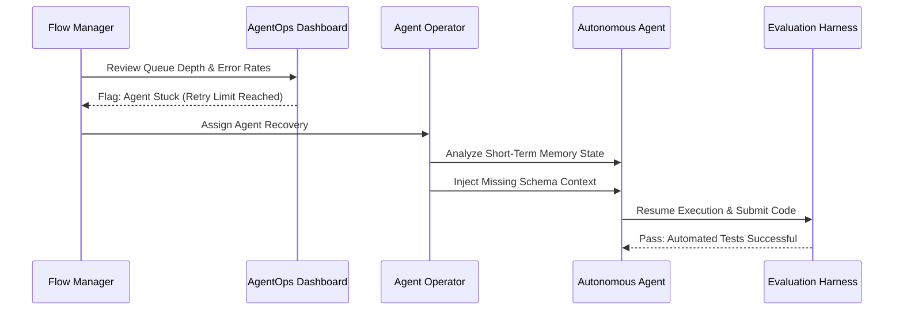

## Visão Geral

As cerimônias Scrum tradicionais foram projetadas para equipes humanas trabalhando em sprints de duas semanas. O desenvolvimento agentic opera em um ritmo fundamentalmente diferente — agents geram código em minutos, não em dias, e o volume de produção sobrecarrega os processos de revisão construídos para entrega em ritmo humano. Esta página define as rotinas de governança que substituem as cerimônias tradicionais, organizadas por cadência, desde a estratégia trimestral até a execução em tempo real.

## Por Que as Cerimônias Tradicionais Falham

As cerimônias Scrum assumem um ritmo previsível: planejar por duas semanas, executar, revisar, retrospectar. Três propriedades dos [[agentic-workflows]] invalidam essa suposição:

- **Velocidade** — Um agent pode produzir um pull request funcional em minutos. Uma cadência de sprint de duas semanas introduz atrasos artificiais entre a especificação e a entrega.
- **Volume** — Um único Agent Operator supervisionando múltiplos agents gera mais produção em um dia do que um desenvolvedor tradicional produz em um sprint. As cerimônias de revisão projetadas para 5-10 PRs por sprint não conseguem lidar com mais de 50 por dia.
- **Imprevisibilidade da produção** — O código gerado por agent varia em qualidade com base na qualidade do context, não no esforço investido. Algumas tarefas são concluídas perfeitamente na primeira execução. Outras exigem múltiplos ciclos de intervenção. As cerimônias de planejamento que assumem dimensionamento uniforme de tarefas produzem previsões imprecisas.

A substituição não é por menos cerimônias — são cerimônias na cadência certa, com os participantes certos, focadas nas atividades que realmente governam a execução orientada por agent.

## Trimestral e Mensal: Alinhamento Estratégico e Saúde do Sistema

### Definição Estratégica de Spec (Trimestral)

A rotina de governança de mais alto nível traduz a visão do produto em trabalho executável por máquina. O Context Architect é o proprietário desta cerimônia.

**Propósito:** Decompor o roadmap do produto em Epics, rascunhar Live Specs de alto nível para cada Epic, e definir portões [[human-in-the-loop]] que determinam quais tarefas exigem aprovação humana durante a execução.

**Atividades:**

1. Revisar o roadmap do produto e identificar os Epics para o próximo trimestre.
2. Para cada Epic, rascunhar um Live Spec de alto nível que capture a intenção, escopo, critérios de aceitação e restrições arquitetônicas.
3. Atribuir níveis de risco a cada Epic e configurar os portões HITL de acordo — Epics de baixo risco podem fluir com revisão humana mínima, enquanto Epics de alto risco exigem aprovação do Agent Operator em cada etapa.
4. Identificar dependências entre Epics e sequenciá-los para minimizar bloqueios.

**Resultado:** Um backlog de Epics priorizado com rascunhos de Live Specs e configurações de portões HITL, pronto para decomposição em trabalho semanal.

**Equivalente Agile:** Quarterly Planning / PI Planning.

### Ciclos de Manutenção do Sistema (Mensal)

As rotinas mensais focam na saúde do sistema — garantindo que a infraestrutura, o context e a economia da execução do agent permaneçam sólidos. Quatro atividades são executadas em paralelo, cada uma de propriedade de um papel diferente:

### Boundary Audit (Principal Architect)

Revisar os limites de domínio quanto à integridade. À medida que os agents geram código em escala, a "deriva arquitetônica" se acumula — módulos desenvolvem dependências indesejadas, bounded contexts vazam e convenções de nomenclatura se erodem. O Boundary Audit detecta essa deriva antes que ela se agrave.

- Executar testes automatizados de restrição de arquitetura em toda a base de código.
- Sinalizar quaisquer novas violações introduzidas desde a última auditoria.
- Atualizar Golden Samples se os padrões evoluíram.

### Context Hygiene Cycle (Context Architect)

Auditar o Context Index quanto à obsolescência, redundância e lacunas. A qualidade da produção do agent degrada quando a base de conhecimento da qual ele se alimenta contém informações desatualizadas ou context ausente.

- Remover schemas de API depreciados, logs de decisão desatualizados e documentação obsoleta.
- Adicionar novas entradas de context para sistemas, APIs ou conceitos de domínio recentemente introduzidos.
- Validar que os Live Specs referenciam fontes de context atuais e precisas.

### FinOps and ROI Review (Flow Manager)

Analisar a economia da execução do agent no último mês. Rastrear o custo por funcionalidade, as tendências de consumo de token e a proporção de valor gerado por agent em relação aos gastos de compute.

- Identificar tarefas onde o custo de execução do agent excedeu o valor entregue.
- Sinalizar padrões de consumo descontrolado de token e implementar proteções de orçamento.
- Relatar métricas de eficiência combinadas aos stakeholders.

### Platform Capability Release (Agent Platform Engineering)

Entregar melhorias de infraestrutura para o ambiente de execução do agent — novas integrações de ferramentas, atualizações de segurança de sandbox e otimizações de desempenho.

- Deploy definições de ferramentas atualizadas e configurações de servidor MCP.
- Roll out patches de segurança para o Workbench Runtime.
- Atualizar políticas de egress de rede com base nos novos requisitos de integração.

## Semanal: Planejamento Tático e Governança

As rotinas semanais formam o batimento cardíaco operacional da Hybrid Squad. Elas substituem o ciclo de Sprint Planning / Sprint Review / Retrospective por atividades ajustadas para a execução orientada por agent.

### Bloco de Specification Engineering

**Substitui:** Backlog Refinement

O Context Architect e o Principal Systems Architect colaboram para produzir Context Packets — os pacotes de especificações, regras arquitetônicas, golden samples e context de domínio que os agents precisam para executar tarefas.

**Atividades:**

1. Selecionar as tarefas de maior prioridade do backlog de Epics.
2. Para cada tarefa, rascunhar um Live Spec detalhado com critérios de aceitação, casos de borda e contratos de entrada/saída.
3. Anexar Golden Samples relevantes e restrições arquitetônicas.
4. Empacotar tudo em um Context Packet pronto para consumo pelo agent.

**Resultado:** Um conjunto de Context Packets, cada um contendo tudo o que um agent precisa para produzir uma implementação funcional.

A qualidade deste bloco determina a qualidade de toda a produção semanal do agent. Apresar o specification engineering para "fazer os agents trabalharem mais rápido" é o erro mais comum e mais custoso que as equipes cometem.

### Planejamento de Context e Alocação

**Substitui:** Sprint Planning

O Context Architect e o Flow Manager triam a complexidade das tarefas, direcionam o trabalho para o executor apropriado e definem o Token Budget semanal.

**Atividades:**

1. Classificar cada tarefa como **Agent-Ready** (context suficiente, spec clara, limites bem definidos) ou **Human-First** (requisitos ambíguos, crítico para segurança, exige decisões arquitetônicas inovadoras).
2. Direcionar tarefas Agent-Ready para o tipo de agent apropriado: Feature Agent para novas funcionalidades, Maintenance Agent para upgrades e migrações.
3. Direcionar tarefas Human-First para Agent Operators para implementação manual.
4. Definir o Token Budget semanal — o gasto máximo de compute autorizado para a execução do agent. Isso evita custos descontrolados e força a priorização.

**Resultado:** Um plano de alocação de tarefas com decisões claras de roteamento e um Token Budget definido.

### Architecture Governance Review

**Substitui:** Tech Design Review

O Principal Systems Architect revisa e aprova (ou rejeita) designs arquitetônicos antes que os agents gerem código significativo. Este é um portão, não uma discussão — designs que violam princípios arquitetônicos são rejeitados e retornados para revisão.

**Atividades:**

1. Revisar designs propostos para as próximas tarefas do agent.
2. Verificar se os designs respeitam os limites de bounded context e as regras de dependência.
3. Aprovar designs que estejam em conformidade com os padrões arquitetônicos.
4. Rejeitar designs que introduziriam dívida estrutural, com orientação específica sobre as correções necessárias.

**Resultado:** Um conjunto de designs aprovados prontos para execução do agent, e um conjunto de designs rejeitados com instruções de revisão.

Esta revisão evita a classe mais cara de erro do agent: código estruturalmente sólido que viola princípios arquitetônicos. Um agent pode produzir um módulo perfeitamente funcional que cria acoplamento indesejado entre domínios. Capturar isso antes da execução economiza ordens de magnitude mais esforço do que corrigi-lo depois.

### Increment Validation e System Retrospective

**Substitui:** Sprint Review

A equipe revisa a produção da semana em Preview Environments — instâncias deployadas e em execução de código gerado por agent — e avalia o desempenho do sistema.

**Atividades:**

1. Demonstrar funcionalidades concluídas em Preview Environments, não apenas diffs de código.
2. Avaliar a **Verificação de Resultado** (a funcionalidade entrega valor de negócio?) em vez de apenas a **Verificação de Produção** (o agent produziu código que passa nos testes?). Uma funcionalidade pode passar em todos os testes e ainda assim falhar em entregar o que o negócio realmente precisa.
3. Revisar métricas de desempenho do agent: Spec-to-Code Ratio, Correction Ratio e aderência ao Token Budget.
4. Identificar melhorias sistêmicas: specs que precisam de mais detalhes, regras arquitetônicas que precisam ser mais rigorosas, lacunas de context que causaram falhas do agent.

**Resultado:** Incrementos validados prontos para produção, e uma lista de melhorias sistêmicas para o próximo ciclo.

## Diário: Execução e o Agent Operator

As rotinas diárias focam na execução em tempo real. O objetivo é manter os agents produtivos e desbloqueados, intervindo precisamente quando e onde o julgamento humano é necessário.

### Daily Flow Sync

**Substitui:** Daily Standup

O Flow Manager lidera uma breve revisão do AgentOps Dashboard — a interface de monitoramento em tempo real que rastreia o status de execução do agent em toda a squad.

**Atividades:**

1. Revisar a profundidade da fila: quantas tarefas estão esperando pela execução do agent, e quantas estão em progresso?
2. Verificar tempos de espera: há alguma tarefa travada esperando por context, revisão ou infraestrutura?
3. Monitorar taxas de erro: os agents estão falhando em taxas mais altas do que o normal, indicando um problema sistêmico com a qualidade do context ou infraestrutura?
4. Identificar agents travados — aqueles que excederam os limites de tentativa ou entraram em loops — e atribuir Agent Recoveries aos Agent Operators.

**Duração:** 10-15 minutos. Este é um check de status, não um fórum de discussão.

**Resultado:** Uma imagem clara da saúde do pipeline e uma lista de Agent Recoveries atribuídas.

### Execução em Tempo Real: A Agent Recovery

Quando um agent fica travado — repetindo um teste falho, mal interpretando uma spec ou produzindo uma saída que viola restrições arquitetônicas — um Agent Operator executa uma Agent Recovery.

**O fluxo de trabalho da Agent Recovery:**

1.  **Diagnosticar** — O operator examina a memória de curto prazo do agent: qual context ele recebeu? Que passos ele tomou? Onde ele divergiu do caminho esperado?
2.  **Injetar** — O operator fornece a peça que falta: uma referência de schema corrigida, uma restrição explícita que o agent ignorou, um esclarecimento de linguagem de spec ambígua. Isso é [[context-engineering]] aplicado em tempo real.
3.  **Retomar** — O agent retoma a execução com o context injetado e continua em direção à conclusão.

Agent Recoveries são a atividade diária de mais alta prioridade. Cada minuto que um agent passa travado é um minuto de compute desperdiçado e throughput do pipeline bloqueado.

### Impondo o Token Budget

O Token Budget definido durante o planejamento semanal não é consultivo — é uma restrição rígida. O Flow Manager monitora o consumo cumulativo de token ao longo do dia e toma decisões de alocação quando o orçamento está sob pressão.

**Quando o orçamento está no caminho certo:** Agents continuam executando tarefas em ordem de prioridade.

**Quando o orçamento está sob pressão:** O Flow Manager deve escolher entre duas opções:

1.  **Alocar mais tokens** — Solicitar um aumento de orçamento da alocação semanal. Isso requer justificativa: quais tarefas estão consumindo mais do que o esperado e por quê?
2.  **Codificar manualmente o código final** — Para tarefas onde o agent produziu 80-90% da solução, mas está consumindo tokens excessivos na etapa final, um Agent Operator assume e completa o trabalho manualmente. Esta é frequentemente a escolha mais econômica para casos de borda complexos.

O Token Budget evita o modo de falha mais comum em equipes agentic: loops de agent descontrolados que consomem milhares de dólares em compute sem produzir valor incremental.

## Rotinas Consolidadas do Framework

A tabela a seguir mapeia cada rotina de governança para sua frequência, proprietário, propósito e equivalente Agile tradicional:

| Frequência | Nome do Evento | Proprietário | Atividade e Propósito | Equivalente Agile |
| :---- | :---- | :---- | :---- | :---- |
| Trimestral | Definição Estratégica de Spec | Context Architect | Decompor a Visão em Epics, rascunhar Live Specs, definir portões HITL. | Quarterly Planning |
| Mensal | Boundary Audit e FinOps | Principal Architect / Flow Mgr | Revisar a integridade do domínio e o ROI do compute por funcionalidade. | Architecture / Budget Review |
| Semanal | Planejamento de Context e Alocação | Context Architect | Triar a complexidade das tarefas, rotear o trabalho, definir o Token Budget semanal. | Sprint Planning |
| Semanal | Architecture Governance | Principal Architect | Aprovar designs antes que os Agents gerem código significativo. | Tech Design Review |
| Diário | Daily Flow Sync | Flow Manager | Identificar Agents travados, atribuir Agent Recoveries, desbloquear filas. | Daily Standup |

## O Que Vem a Seguir

A próxima página apresenta um estudo de caso completo, de ponta a ponta, mostrando como essas rotinas funcionam juntas na prática — desde a definição trimestral do epic até a execução diária do agent, incluindo uma agent recovery. Depois disso, a página final aborda as métricas e os frameworks de rastreamento de sucesso que medem se essas rotinas estão realmente funcionando.
