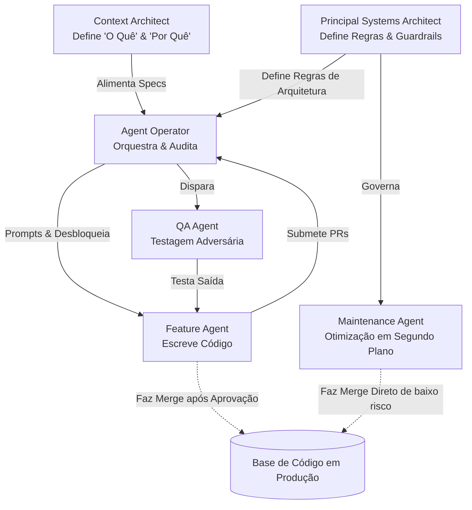

## Visão Geral

A equipe de software tradicional — um grupo de humanos dividindo tarefas de código entre si — está dando lugar a uma nova formação. A Hybrid Squad combina um pequeno núcleo humano com uma frota de AI agents, mudando o esforço humano da execução linha a linha para orquestração, arquitetura e intenção estratégica. Esta página explica como estruturar essa equipe, definir seus papéis e conectá-la em uma unidade de trabalho.

## Do Modelo de Fábrica ao Modelo Diretor-Executor

As estruturas de equipe convencionais seguem o que você pode chamar de Modelo de Fábrica: o trabalho chega como tickets, os humanos os pegam, escrevem código, revisam o trabalho uns dos outros e entregam. Cada linha de código de produção passa por mãos humanas. Isso funcionava quando o código era o gargalo. Ele falha quando AI agents podem gerar, testar e refatorar código mais rápido do que os humanos podem digitar.

O Modelo Diretor-Executor inverte a proporção. A expertise humana se concentra em três atividades de alta alavancagem:

- **Orquestração** — decidindo o que será construído, em que ordem e por quem (ou o quê)
- **Intenção estratégica** — traduzindo objetivos de negócios em especificações precisas que os agents podem agir
- **Governança arquitetural** — estabelecendo as regras, limites e padrões de qualidade que restringem a saída do agent

A Agent Fleet lida com a execução de alto volume: escrevendo código de implementação, executando suítes de teste, realizando migrações e realizando refatorações repetitivas. Os humanos deixam de ser o chão de fábrica e passam a ser os diretores, arquitetos e controladores de qualidade.

Isso não é sobre substituir desenvolvedores. É sobre reconhecer que [[agentic-workflows]] mudam onde o julgamento humano cria mais valor. Um engenheiro sênior revisando 20 pull requests geradas por agents por dia entrega mais impacto do que o mesmo engenheiro escrevendo 2 pull requests manualmente.

## AI Agents como Executores Gerenciados

Em uma Hybrid Squad, os AI agents não são ferramentas ad-hoc que você invoca — eles são executores gerenciados com responsabilidades definidas. Eles recebem permissões de sistema, são atribuídos a tarefas através do backlog e estão sujeitos a acompanhamento de desempenho, assim como qualquer colaborador.

Essa estrutura é importante porque muda a forma como você gerencia a qualidade. Em vez de perguntar "a ferramenta produziu a saída correta?", você pergunta "este membro da equipe está atendendo aos seus padrões de desempenho?". O desempenho do agent é rastreado por métricas como:

- **Spec-to-Code Ratio** — Quão fielmente a saída do agent corresponde à especificação que ele recebeu? Uma alta proporção significa que o agent entendeu a intenção corretamente.
- **Correction Ratio** — Quantas intervenções humanas são necessárias por execução do agent? Uma baixa proporção indica que o agent pode trabalhar autonomamente. Uma alta proporção sinaliza que as specs, o context ou os guardrails precisam de melhoria.

Quando um agent consistentemente tem um desempenho abaixo do esperado, você não culpa o agent — você melhora as entradas que ele recebe. Melhores especificações, context mais rico, restrições arquitetônicas mais rigorosas. O mesmo princípio que se aplica aos membros da equipe humana se aplica aqui: a produção deficiente é geralmente um problema de gerenciamento, não um problema de talento.

## O Núcleo Humano

O lado humano de uma Hybrid Squad consiste em três papéis. Cada um se concentra em uma dimensão diferente do Modelo Diretor-Executor.

### Principal Systems Architect

O Principal Systems Architect é responsável pela integridade estrutural da base de código. Eles não escrevem a maior parte do código — eles definem as regras arquitetônicas que governam como o código é escrito.

Responsabilidades principais:

- **Lei arquitetural** — Definir contextos delimitados, limites de módulo e contratos de integração que os agents devem respeitar
- **Golden Samples** — Curar implementações de referência que os agents usam como templates para novo código. Um golden sample bem escolhido ensina mais a um agent do que páginas de instruções.
- **Aplicação de limite de domínio** — Garantir que o código gerado pelo agent respeite a separação de preocupações, não crie acoplamento indesejado e siga padrões estabelecidos

O Principal Systems Architect opera a montante da execução. Sua saída são restrições, não código. Quando um agent produz um pull request que viola princípios arquitetônicos, a causa raiz remonta a uma especificação arquitetônica incompleta ou pouco clara — não ao agent em si.

### Context Architect

O Context Architect substitui o tradicional Product Manager em uma equipe agentic. Onde um PM escreve user stories para desenvolvedores humanos, o Context Architect pratica a Spec Engineering — traduzindo o "Porquê" do negócio em Live Specs legíveis por máquina que os agents podem executar.

Responsabilidades principais:

- **Spec Engineering** — Produzir especificações detalhadas e estruturadas que incluem critérios de aceitação, casos de borda e referências de context. Estas não são user stories vagas — elas são precisas o suficiente para um [[autonomous-agent]] agir sem ambiguidade.
- **Curadoria do Context Index** — Manter a base de conhecimento de onde os agents extraem informações: schemas de API, glossários de domínio, logs de decisão e padrões de implementação anteriores
- **Configuração de porta [[human-in-the-loop]]** — Decidir quais tarefas exigem aprovação humana antes do merge e quais podem prosseguir autonomamente com base no nível de risco

A qualidade da saída do agent é diretamente proporcional à qualidade do context que ele recebe. O Context Architect é responsável por essa qualidade de entrada.

### Agent Operators

Os Agent Operators são a evolução do Software Engineer. Eles não passam a maior parte do tempo escrevendo código do zero. Em vez disso, eles orquestram as Agent Runs — configurando, lançando, monitorando e auditando o trabalho que os agents produzem.

Responsabilidades principais:

- **Orquestração de agents** — Selecionar o agent certo para cada tarefa, configurar sua context window e definir parâmetros de execução
- **Agent recoveries** — Intervir quando um agent fica preso em um loop, interpreta mal uma spec ou produz uma saída que falha nos testes. O Agent Operator diagnostica a falha, fornece context corretivo e relança.
- **Auditorias finais** — Revisar pull requests gerados por agents para correção, segurança e alinhamento com os padrões arquitetônicos antes de aprovar os merges

Os Agent Operators ainda escrevem código — particularmente para componentes críticos do "Human-Owned Core" onde a tolerância a risco é zero. Mas a maior parte do tempo deles se volta para revisão, orquestração e garantia de qualidade.

## A Agent Fleet

O lado não-humano da equipe consiste em agents especializados, cada um projetado para uma classe diferente de trabalho.

### Maintenance Agent

O Maintenance Agent lida com as tarefas de segundo plano que consomem tempo desproporcional de engenharia: upgrades de dependências, correções de linting, migração de código legado e correção de desvio de configuração.

- **Nível de supervisão:** Quase zero. Essas tarefas têm entradas e saídas bem definidas com baixa ambiguidade.
- **Autoridade de merge:** Pode fazer merge diretamente para mudanças de baixo risco (patches de dependência, correções de formatação) com verificações automatizadas como a única porta.
- **Valor:** Libera engenheiros humanos da carga de manutenção que tipicamente consome 20-40% da capacidade da equipe.

### Feature Agent

O Feature Agent constrói novas funcionalidades a partir de tickets do backlog. Ele opera sob demanda — é ativado quando um ticket está pronto para implementação e desativado quando o pull request é enviado.

- **Nível de supervisão:** Moderado. Opera em um Workbench seguro (ambiente isolado) com um modelo human-in-the-loop. O Agent Operator revisa a saída antes do merge.
- **Fluxo de trabalho:** Recebe um Context Packet (spec + regras arquitetônicas + golden samples), escreve código de implementação, gera testes, itera até que os testes passem e envia um PR para revisão humana.
- **Valor:** Lida com o volume de trabalho de funcionalidades que, de outra forma, exigiria uma equipe de engenharia maior.

### QA Agent

O QA Agent serve como uma camada adversária automatizada. Em vez de verificar se o código funciona para o caminho feliz, ele tenta ativamente quebrar as coisas.

- **Nível de supervisão:** Baixo. Seu trabalho é identificar problemas, não fazer merge de código.
- **Abordagem:** Gera entradas de casos de borda, testa a lógica sob estresse com dados inesperados, investiga condições de corrida e valida caminhos de tratamento de erros.
- **Valor:** Captura a classe de bugs que os humanos perdem porque testam inconscientemente os caminhos que esperam que funcionem. O QA Agent não tem esse viés — ele é projetado para atacar. Ele trabalha ao lado do processo de [[ai-assisted-code-review]] para garantir que o código gerado pelo agent atenda aos padrões de qualidade.

## A Hierarquia da Hybrid Squad

O diagrama a seguir mostra como as informações e a autoridade fluem através da equipe:

Observe o fluxo: especificações e regras arquitetônicas convergem no Agent Operator, que atua como ponto de controle para a execução do agent. Os Feature Agents nunca fazem merge de seu próprio trabalho — um Agent Operator deve aprovar. Os Maintenance Agents têm um caminho direto para produção para mudanças pré-aprovadas e de baixo risco. O QA Agent cria um loop de feedback que captura problemas antes que cheguem à revisão.

## O Fluxo de Trabalho SDD

A Hybrid Squad opera através de um fluxo de trabalho Spec-Driven Development (SDD) que se desenrola em três fases:

### 1. Refinamento

O Context Architect e o Principal Systems Architect colaboram para produzir um "Context Packet" — um pacote de tudo o que o Feature Agent precisa para executar:

- A Live Spec com critérios de aceitação e casos de borda
- Regras e restrições arquitetônicas para o módulo relevante
- Golden Samples mostrando o estilo de código e os padrões esperados
- Links para o domain context relevante (schemas de API, implementações anteriores)

O Refinamento substitui a tradicional reunião de planejamento da Sprint. A saída não é uma lista de tarefas para humanos — é um conjunto de especificações executáveis por máquina.

### 2. Execução

O Agent Operator alimenta o Context Packet para o Feature Agent, que:

- Escreve código de implementação correspondendo à spec
- Gera casos de teste cobrindo os critérios de aceitação especificados
- Executa testes e corrige falhas em um loop contínuo
- Submete um pull request quando todos os critérios são aprovados

Esta fase geralmente é concluída em minutos, em vez de dias. O agent trabalha continuamente, sem mudanças de context, reuniões ou interrupções.

### 3. Revisão

O Agent Operator revisa o pull request do agent em relação à spec original e às regras arquitetônicas. Enquanto isso, o Evaluation Engineer (um papel especializado de QA abordado na próxima página) constrói guardrails automatizados — harnesses de teste, verificações de restrição e rubricas de avaliação — que validam a saída do agent em escala.

A revisão na Hybrid Squad não é apenas sobre correção. É sobre calibrar o sistema: identificar onde as specs eram ambíguas, onde as regras arquitetônicas precisam ser mais rígidas e onde os agents precisam de um context melhor. Cada ciclo de revisão melhora o próximo ciclo de execução.

## O Que Vem a Seguir

A Hybrid Squad define a estrutura da equipe. A próxima página detalha os papéis individuais — o que cada pessoa faz no dia-a-dia, quais habilidades são necessárias e como os papéis tradicionais se mapeiam para suas contrapartes agentic.
