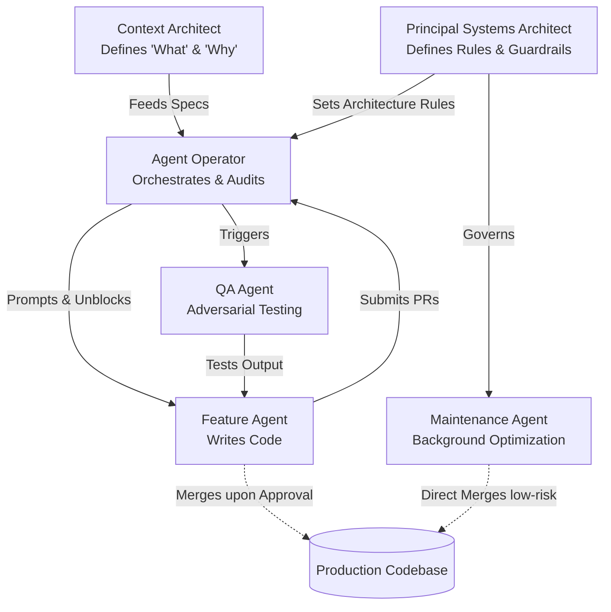

## Overview

The traditional software team — a group of humans dividing code tasks among themselves — is giving way to a new formation. The Hybrid Squad pairs a small human core with a fleet of AI agents, shifting human effort from line-by-line execution to orchestration, architecture, and strategic intent. This page explains how to structure that squad, define its roles, and wire it together into a working unit.

## From Factory Model to Director-Executor Model

Conventional team structures follow what you might call the Factory Model: work arrives as tickets, humans pick them up, write code, review each other's output, and ship. Every line of production code flows through human hands. This worked when code was the bottleneck. It breaks down when AI agents can generate, test, and refactor code faster than humans can type.

The Director-Executor Model inverts the ratio. Human expertise concentrates on three high-leverage activities:

- **Orchestration** — deciding what gets built, in what order, and by whom (or what)
- **Strategic intent** — translating business goals into precise specifications that agents can act on
- **Architectural governance** — setting the rules, boundaries, and quality standards that constrain agent output

The Agent Fleet handles high-volume execution: writing implementation code, running test suites, performing migrations, and grinding through repetitive refactors. Humans stop being the factory floor and start being the directors, architects, and quality controllers.

This is not about replacing developers. It is about recognizing that [[agentic-workflows]] change where human judgment creates the most value. A senior engineer reviewing 20 agent-generated pull requests per day delivers more impact than that same engineer writing 2 pull requests by hand.

## AI Agents as Synthetic Team Members

In a Hybrid Squad, AI agents are not tools you invoke — they are synthetic team members. They are granted system permissions, assigned tasks through the backlog, and subjected to performance reviews just like any contributor.

This framing matters because it changes how you manage quality. Instead of asking "did the tool produce correct output?" you ask "is this team member meeting its performance standards?" Agent performance is tracked through metrics like:

- **Spec-to-Code Ratio** — How faithfully does the agent's output match the specification it received? A high ratio means the agent understood intent correctly.
- **Correction Ratio** — How many human interventions are needed per agent run? A low ratio indicates the agent can work autonomously. A high ratio signals that specs, context, or guardrails need improvement.

When an agent consistently underperforms, you do not blame the agent — you improve the inputs it receives. Better specifications, richer context, tighter architectural constraints. The same principle that applies to human team members applies here: poor output is usually a management problem, not a talent problem.

## The Human Core

The human side of a Hybrid Squad consists of three roles. Each concentrates on a different dimension of the Director-Executor Model.

### Principal Systems Architect

Think of this role as the "City Planner" of the codebase. The Principal Systems Architect does not write most of the code — they define the laws that govern how code gets written.

Core responsibilities:

- **Architectural law** — Defining bounded contexts, module boundaries, and integration contracts that agents must respect
- **Golden Samples** — Curating reference implementations that agents use as templates for new code. A well-chosen golden sample teaches an agent more than pages of instructions.
- **Domain boundary enforcement** — Ensuring that agent-generated code respects the separation of concerns, does not create unwanted coupling, and follows established patterns

The Principal Systems Architect operates upstream of execution. Their output is constraints, not code. When an agent produces a pull request that violates architectural principles, the root cause traces back to an incomplete or unclear architectural specification — not to the agent itself.

### Context Architect

The Context Architect replaces the traditional Product Manager in an agentic team. Where a PM writes user stories for human developers, the Context Architect practices Spec Engineering — translating the business "Why" into machine-readable Live Specs that agents can execute against.

Core responsibilities:

- **Spec Engineering** — Producing detailed, structured specifications that include acceptance criteria, edge cases, and context references. These are not vague user stories — they are precise enough for an [[autonomous-agent]] to act on without ambiguity.
- **Context Index curation** — Maintaining the knowledge base that agents draw from: API schemas, domain glossaries, decision logs, and prior implementation patterns
- **[[human-in-the-loop]] gate configuration** — Deciding which tasks require human approval before merging and which can proceed autonomously based on risk level

The quality of agent output is directly proportional to the quality of context it receives. The Context Architect owns that input quality.

### Agent Operators

Agent Operators are the evolution of the Software Engineer. They do not spend most of their time writing code from scratch. Instead, they orchestrate Agent Runs — configuring, launching, monitoring, and auditing the work that agents produce.

Core responsibilities:

- **Agent orchestration** — Selecting the right agent for each task, configuring its context window, and setting execution parameters
- **Rescue missions** — Intervening when an agent gets stuck in a loop, misinterprets a spec, or produces output that fails tests. The Agent Operator diagnoses the failure, provides corrective context, and re-launches.
- **Final audits** — Reviewing agent-generated pull requests for correctness, security, and alignment with architectural standards before approving merges

Agent Operators still write code — particularly for critical "Core Nucleus" components where the risk tolerance is zero. But the bulk of their time shifts to review, orchestration, and quality assurance.

## The Agent Fleet

The non-human side of the squad consists of specialized agents, each designed for a different class of work.

### Maintenance Agent

The Maintenance Agent handles the background tasks that consume disproportionate engineering time: dependency upgrades, linting fixes, legacy code migration, and configuration drift correction.

- **Supervision level:** Near-zero. These tasks have well-defined inputs and outputs with low ambiguity.
- **Merge authority:** Can merge directly for low-risk changes (dependency patches, formatting fixes) with automated checks as the only gate.
- **Value:** Frees human engineers from the maintenance tax that typically consumes 20-40% of team capacity.

### Feature Agent

The Feature Agent builds new functionality from backlog tickets. It operates on-demand — spun up when a ticket is ready for implementation and shut down when the pull request is submitted.

- **Supervision level:** Moderate. Operates in a secure Workbench (sandboxed environment) with a human-in-the-loop model. The Agent Operator reviews output before merge.
- **Workflow:** Receives a Context Packet (spec + architectural rules + golden samples), writes implementation code, generates tests, iterates until tests pass, and submits a PR for human review.
- **Value:** Handles the volume of feature work that would otherwise require a larger engineering team.

### QA Agent

The QA Agent serves as an automated adversarial layer. Rather than checking if code works for the happy path, it actively tries to break things.

- **Supervision level:** Low. Its job is to surface problems, not to merge code.
- **Approach:** Generates edge-case inputs, stress-tests logic with unexpected data, probes for race conditions, and validates error handling paths.
- **Value:** Catches the class of bugs that humans miss because they unconsciously test the paths they expect to work. The QA Agent has no such bias — it is designed to attack. It works alongside the [[ai-assisted-code-review]] process to ensure agent-generated code meets quality standards.

## The Hybrid Squad Hierarchy

The following diagram shows how information and authority flow through the squad:

Notice the flow: specifications and architectural rules converge on the Agent Operator, who acts as the control point for agent execution. Feature Agents never merge their own work — an Agent Operator must approve. Maintenance Agents have a direct path to production for pre-approved, low-risk changes. The QA Agent creates a feedback loop that catches problems before they reach review.

## The SDD Workflow

The Hybrid Squad operates through a Spec-Driven Development (SDD) workflow that unfolds in three phases:

### 1. Refinement

The Context Architect and Principal Systems Architect collaborate to produce a "Context Packet" — a bundle of everything the Feature Agent needs to execute:

- The Live Spec with acceptance criteria and edge cases
- Architectural rules and constraints for the relevant module
- Golden Samples showing the expected code style and patterns
- Links to relevant domain context (API schemas, prior implementations)

Refinement replaces the traditional sprint planning meeting. The output is not a list of tasks for humans — it is a set of machine-executable specifications.

### 2. Execution

The Agent Operator feeds the Context Packet to the Feature Agent, which:

- Writes implementation code matching the spec
- Generates test cases covering the specified acceptance criteria
- Runs tests and fixes failures in a tight loop
- Submits a pull request when all criteria pass

This phase typically completes in minutes rather than days. The agent works continuously without context switches, meetings, or interruptions.

### 3. Review

The Agent Operator reviews the agent's pull request against the original spec and architectural rules. Meanwhile, the Evaluation Engineer (a specialized QA role covered in the next page) builds automated guardrails — test harnesses, constraint checks, and evaluation rubrics — that validate agent output at scale.

Review in the Hybrid Squad is not just about correctness. It is about calibrating the system: identifying where specs were ambiguous, where architectural rules need tightening, and where agents need better context. Every review cycle improves the next execution cycle.

## What Comes Next

The Hybrid Squad defines the team structure. The next page dives into the individual roles in detail — what each person does day-to-day, what skills they need, and how traditional roles map to their agentic counterparts.
